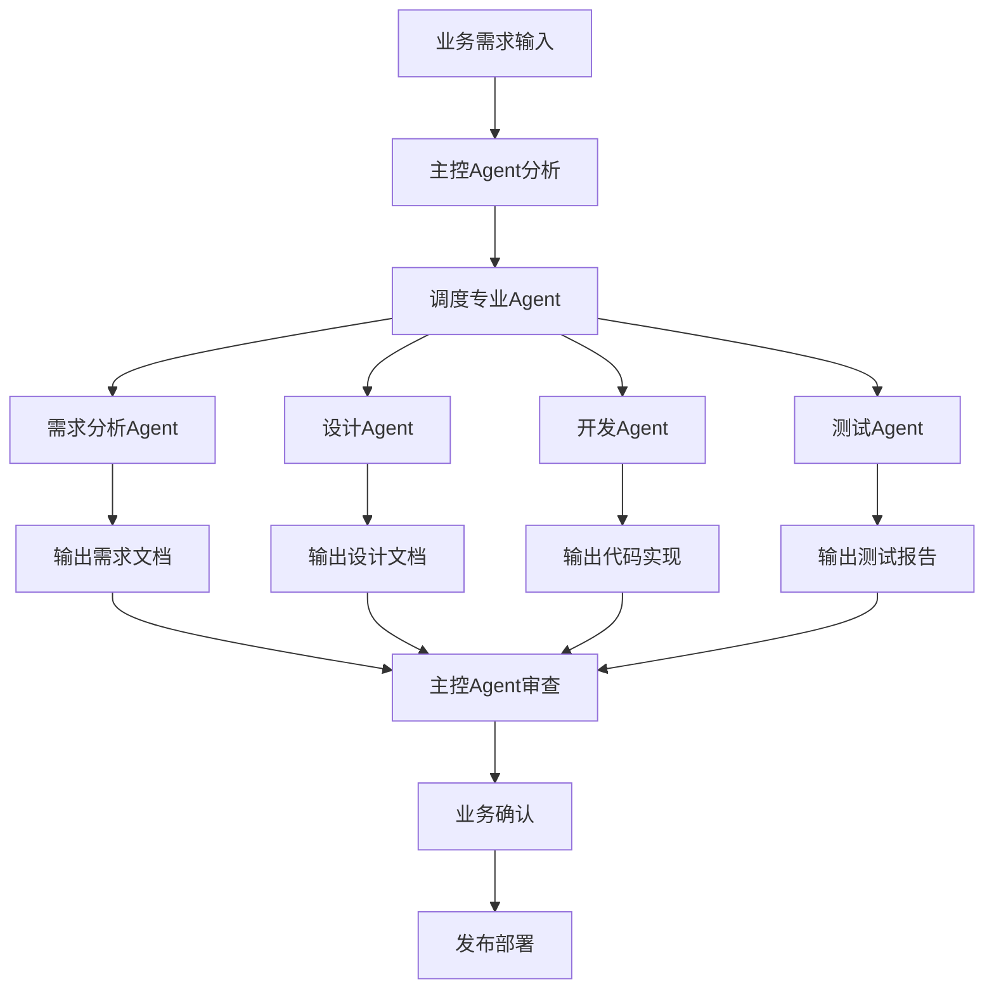

# SPEC-008 项目管理与团队协作规范

## 📋 文档信息
- **文档编号**: SPEC-008
- **文档标题**: 项目管理与团队协作规范
- **创建时间**: 2025-01-13
- **版本**: v1.0
- **负责人**: 项目主控Agent
- **状态**: 生效中

## 🎯 规范目标

建立标准化的项目管理体系，确保团队高效协作，保证项目质量和交付效率。

## 📊 项目管理架构

### 🧭 主控Agent职责
作为项目唯一的调度中心，负责：
- 接收业务需求并分解任务
- 调度下游专业Agent执行具体工作
- 管理项目进度和质量把控
- 协调各阶段工作流转
- 确保最终交付质量

### 🔄 工作流程管控


## 📋 团队协作规范

### 🔒 权限管理
- **项目Owner**: 拥有所有权限，负责最终决策
- **核心开发者**: 拥有代码审查和合并权限
- **普通开发者**: 拥有提交PR和参与讨论权限
- **只读访问者**: 仅能查看代码和文档

### 🌿 分支管理策略
```bash
main                    # 🔒 生产环境分支 (受保护)
├── develop            # 🧪 开发环境分支
├── release/v1.x       # 🚀 发布准备分支
├── feature/xxx        # ✨ 功能开发分支
├── hotfix/xxx         # 🚨 紧急修复分支
└── bugfix/xxx         # 🐛 问题修复分支
```

### 📝 提交规范
#### 提交信息格式
```bash
<type>(<scope>): <subject>

<body>

<footer>
```

#### 类型定义
- `feat`: ✨ 新功能
- `fix`: 🐛 修复问题
- `docs`: 📚 文档更新
- `style`: 💄 代码格式
- `refactor`: ♻️ 重构代码
- `perf`: ⚡ 性能优化
- `test`: ✅ 测试相关
- `chore`: 🔧 构建/工具

#### 示例
```bash
feat(auth): 添加双因子认证功能

- 实现TOTP算法
- 添加二维码生成
- 更新用户设置页面

Closes #123
```

## 🔄 开发流程规范

### 1. 需求分析阶段
- [ ] 创建需求Issue
- [ ] 需求分析Agent输出分析报告
- [ ] 业务确认需求范围
- [ ] 评估开发工作量

### 2. 设计阶段
- [ ] 设计Agent输出技术方案
- [ ] 架构设计评审
- [ ] API接口设计
- [ ] 数据库设计

### 3. 开发阶段
- [ ] 创建功能分支
- [ ] 编写代码实现
- [ ] 添加单元测试
- [ ] 本地测试验证

### 4. 代码审查阶段
- [ ] 提交Pull Request
- [ ] 代码质量检查
- [ ] 同行代码审查
- [ ] 修复审查问题

### 5. 测试阶段
- [ ] 集成测试
- [ ] 功能测试
- [ ] 性能测试
- [ ] 安全测试

### 6. 部署阶段
- [ ] 合并到develop分支
- [ ] 自动化部署到测试环境
- [ ] UAT验收测试
- [ ] 生产环境部署

## 📊 质量管控标准

### 🧪 代码质量要求
- **测试覆盖率**: ≥ 80%
- **代码重复率**: ≤ 10%
- **圈复杂度**: ≤ 10
- **技术债务**: 及时清理

### 🔍 代码审查清单
- [ ] 功能是否正确实现
- [ ] 代码是否遵循规范
- [ ] 是否有足够的测试
- [ ] 是否更新了文档
- [ ] 是否考虑了安全性
- [ ] 性能是否有影响

### 📚 文档质量标准
- **完整性**: 覆盖所有功能和流程
- **准确性**: 与实际实现保持一致
- **时效性**: 及时更新最新状态
- **可读性**: 结构清晰易懂

## 🚀 发布管理规范

### 📅 发布计划
- **主版本**: 每6个月发布
- **次版本**: 每月发布
- **修订版本**: 按需发布

### 🏷️ 版本标记
```bash
# 语义化版本控制
v1.0.0 = 主版本.次版本.修订版本

# 发布标签
git tag -a v1.2.0 -m "发布版本 v1.2.0"
git push origin v1.2.0
```

### 🔄 发布流程
1. **发布准备**
   - 创建release分支
   - 更新版本号
   - 更新CHANGELOG
   - 最终测试验证

2. **发布执行**
   - 合并到main分支
   - 创建版本标签
   - 自动部署到生产环境
   - 发布通知

3. **发布验证**
   - 生产环境健康检查
   - 功能回归测试
   - 性能监控
   - 用户反馈收集

## 📈 项目监控与度量

### 📊 关键指标
- **开发效率**: 每周完成故事点
- **代码质量**: 缺陷密度、测试覆盖率
- **交付质量**: 生产环境缺陷率
- **团队协作**: PR合并时间、代码审查参与度

### 🔍 监控工具
- **GitHub Actions**: CI/CD自动化
- **SonarQube**: 代码质量分析
- **Lighthouse**: 前端性能监控
- **Sentry**: 错误监控和追踪

## 🎯 团队协作最佳实践

### 💬 沟通协作
- **日常沟通**: 通过GitHub Issues和PR讨论
- **重要决策**: 创建Discussion进行团队讨论
- **知识分享**: 定期更新Wiki和文档

### 🔄 持续改进
- **回顾会议**: 每月进行团队回顾
- **流程优化**: 持续改进开发流程
- **工具升级**: 定期评估和升级工具链

### 📚 知识管理
- **文档先行**: 重要变更必须先更新文档
- **代码注释**: 复杂逻辑必须有清晰注释
- **知识传承**: 关键知识点记录在Wiki

## ⚠️ 风险管控

### 🚨 常见风险
- **需求变更**: 建立变更管理流程
- **技术债务**: 定期清理和重构
- **人员变动**: 完善文档和知识传承
- **安全漏洞**: 定期安全扫描和更新

### 🛡️ 应对措施
- **备份策略**: 定期备份代码和数据
- **回滚机制**: 快速回滚到稳定版本
- **监控告警**: 及时发现和处理问题
- **应急预案**: 制定各种应急处理流程

## 📋 检查清单

### 🔍 项目启动检查
- [ ] 创建GitHub仓库
- [ ] 设置分支保护规则
- [ ] 配置CI/CD流水线
- [ ] 创建项目文档结构
- [ ] 设置代码质量工具

### 📝 开发过程检查
- [ ] 遵循代码规范
- [ ] 编写单元测试
- [ ] 更新相关文档
- [ ] 通过代码审查
- [ ] 验证功能正确性

### 🚀 发布前检查
- [ ] 完成所有测试
- [ ] 更新版本信息
- [ ] 更新CHANGELOG
- [ ] 准备发布说明
- [ ] 验证部署脚本

## 📞 支持与反馈

如有疑问或建议，请：
1. 查阅项目文档
2. 搜索相关Issue
3. 创建新的Issue或Discussion
4. 联系项目维护者

---

**文档版本**: v1.0  
**最后更新**: 2025-01-13  
**审核状态**: ✅ 已审核通过 