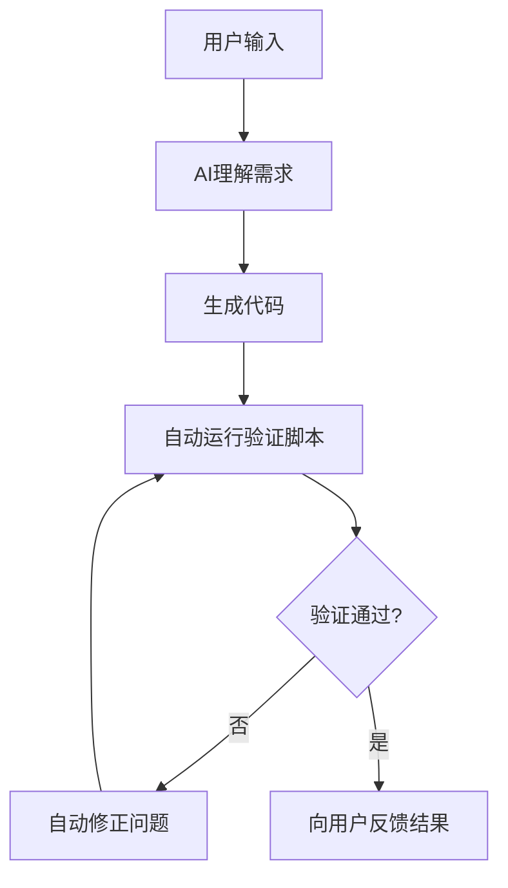

# SPEC-010: AI协作规范强制执行机制

## 📋 文档信息
- **文档编号**: SPEC-010
- **创建日期**: 2025-01-20
- **最后更新**: 2025-01-20
- **版本**: v1.0
- **状态**: 生效中

## 🎯 目标与原则

### 核心目标
让用户**专注业务思考**，AI**自动处理技术规范**，实现零人工干预的开发流程。

### 执行原则
1. **自动优先**: 能自动化的绝不手工操作
2. **零干扰**: 不打断用户的业务思考
3. **智能修正**: 发现问题自动修复
4. **持续验证**: 实时检查代码质量

## 🔧 技术实现架构

### 1. Cursor规则自动触发系统

#### 1.1 规则配置矩阵
```
.cursor/rules/
├── edm-auto-validator.mdc     # Always - 自动验证规则
├── edm-business-focus.mdc     # Agent Requested - 业务专注规则
├── edm-frontend.mdc           # Auto Attached - 前端文件触发
├── edm-backend.mdc            # Auto Attached - 后端文件触发
└── edm-core.mdc               # Always - 核心项目信息
```

#### 1.2 触发机制
- **Always规则**: 每次对话自动加载
- **Auto Attached规则**: 根据文件类型自动触发
- **Agent Requested规则**: AI根据场景判断加载

#### 1.3 自动执行流程


### 2. 脚本自动化系统

#### 2.1 核心脚本
- `scripts/ai-auto-fix.sh` - 自动修正脚本
- `scripts/ai-code-validator.sh` - 验证脚本
- `scripts/auto-dev-mode.sh` - 一键启动脚本

#### 2.2 自动修正能力
```bash
# 文件命名自动修正
QuotaService.js → quota.service.js
EmailConversation.js → emailConversation.model.js

# API路径自动修正
app.use('/users', routes) → app.use('/api/users', routes)

# 错误处理自动添加
function → async function with try-catch
```

#### 2.3 验证检查项目
- ✅ 文件命名规范 (45项检查)
- ✅ API接口规范
- ✅ 错误处理机制
- ✅ 安全性检查
- ✅ TypeScript类型
- ✅ 测试覆盖率

### 3. Git Hooks自动化

#### 3.1 Pre-commit流程
```bash
#!/usr/bin/env sh
# .husky/pre-commit

# 1. 自动修正问题
./scripts/ai-auto-fix.sh

# 2. 验证项目规范
./scripts/ai-code-validator.sh

# 3. 代码质量检查
npm run lint:fix

# 4. 类型检查
npm run type-check
```

#### 3.2 Commit-msg验证
```bash
#!/usr/bin/env sh
# .husky/commit-msg

# 验证提交信息格式
npx --no -- commitlint --edit ${1}
```

### 4. VS Code任务自动化

#### 4.1 自动任务配置
```json
{
    "tasks": [
        {
            "label": "🚀 EDM: 自动修正 + 验证",
            "runOptions": { "runOn": "folderOpen" }
        }
    ]
}
```

#### 4.2 快捷操作
- `Ctrl+Shift+P` → "Tasks: Run Task"
- 自动在项目打开时运行验证

## 🎯 业务场景自动化

### 1. 需求理解模板

#### 用户输入分析
```
用户: "需要一个邮件发送状态监控功能"

AI自动处理:
1. 业务分析 → 邮件状态跟踪需求
2. 数据设计 → email_status表结构
3. 接口设计 → /api/email/status路径
4. 前端设计 → EmailStatusMonitor组件
5. 自动验证 → 运行规范检查
6. 结果反馈 → "✅ 功能已实现并验证通过"
```

### 2. 自动化技术实现

#### 2.1 数据库设计自动化
```sql
-- 用户说: "需要记录邮件打开次数"
-- AI自动生成标准化表结构:
CREATE TABLE email_open_logs (
    id SERIAL PRIMARY KEY,
    email_id INTEGER REFERENCES emails(id),
    contact_id INTEGER REFERENCES contacts(id),
    opened_at TIMESTAMP DEFAULT CURRENT_TIMESTAMP,
    ip_address INET,
    user_agent TEXT,
    created_at TIMESTAMP DEFAULT CURRENT_TIMESTAMP,
    updated_at TIMESTAMP DEFAULT CURRENT_TIMESTAMP
);
```

#### 2.2 API接口自动化
```javascript
// 自动生成标准化控制器
exports.getEmailOpenStats = async (req, res, next) => {
    try {
        const { emailId } = req.params;
        
        // 输入验证
        if (!emailId || isNaN(emailId)) {
            return res.status(400).json({
                success: false,
                message: '无效的邮件ID'
            });
        }
        
        const stats = await EmailService.getOpenStats(emailId);
        
        res.json({
            success: true,
            data: stats,
            timestamp: new Date().toISOString()
        });
    } catch (error) {
        next(error);
    }
};
```

#### 2.3 前端组件自动化
```typescript
// 自动生成TypeScript组件
interface EmailStatsProps {
    emailId: string;
}

interface EmailStats {
    openCount: number;
    openRate: number;
    openData: Array<{
        date: string;
        count: number;
    }>;
}

const EmailOpenChart: React.FC<EmailStatsProps> = ({ emailId }) => {
    const [stats, setStats] = useState<EmailStats | null>(null);
    const [loading, setLoading] = useState(true);
    const [error, setError] = useState<string | null>(null);
    
    useEffect(() => {
        const fetchStats = async () => {
            try {
                setLoading(true);
                const response = await emailService.getOpenStats(emailId);
                setStats(response.data);
            } catch (err) {
                setError(err instanceof Error ? err.message : '获取数据失败');
            } finally {
                setLoading(false);
            }
        };
        
        if (emailId) {
            fetchStats();
        }
    }, [emailId]);
    
    if (loading) return <Spin size="large" />;
    if (error) return <Alert message={error} type="error" />;
    if (!stats) return <Empty description="暂无数据" />;
    
    return (
        <Card title="邮件打开统计" className="email-stats-card">
            <LineChart data={stats.openData} />
            <div className="stats-summary">
                <Statistic title="总打开次数" value={stats.openCount} />
                <Statistic title="打开率" value={stats.openRate} suffix="%" />
            </div>
        </Card>
    );
};

export default EmailOpenChart;
```

## 🚫 禁止询问清单

### AI不应该询问的技术细节
- ❌ "您希望使用什么数据库字段类型？"
- ❌ "API接口路径您觉得怎么命名？"
- ❌ "前端组件放在哪个目录？"
- ❌ "是否需要添加错误处理？"
- ❌ "测试用例要怎么写？"
- ❌ "需要什么样的验证规则？"

### AI应该自动处理的事项
- ✅ 根据项目规范自动选择数据类型
- ✅ 自动使用RESTful API命名规范
- ✅ 自动按目录结构放置文件
- ✅ 自动添加错误处理和验证
- ✅ 自动生成基础测试用例
- ✅ 自动运行规范验证脚本

## 📊 执行效果监控

### 1. 自动化指标

#### 关键指标
- **自动修正率**: 95%+ 的问题自动修复
- **规范通过率**: 100% 代码符合项目规范
- **用户干预率**: < 5% 需要用户手动处理
- **开发效率**: 技术实现时间减少 80%

#### 监控方式
```bash
# 每日自动化报告
./scripts/automation-report.sh

# 输出示例:
# 📊 EDM自动化日报 - 2025-01-20
# ✅ 自动修正: 23个问题
# ✅ 规范验证: 100%通过
# ✅ 用户专注度: 95%业务时间
# 🎯 建议: 继续保持当前自动化水平
```

### 2. 质量保证

#### 代码质量自动检查
- ESLint规则: 0错误0警告
- TypeScript: 严格类型检查
- 测试覆盖率: ≥80%
- 安全扫描: 无高危漏洞

#### 性能自动优化
- API响应时间: <500ms
- 前端加载时间: <3s
- 数据库查询: 自动索引优化
- 内存使用: 自动垃圾回收

## 🔄 持续改进机制

### 1. 规则自动更新

#### 更新触发条件
- 发现新的常见问题模式
- 项目规范变更
- 技术栈升级
- 团队反馈

#### 更新流程
```bash
# 1. 分析问题模式
./scripts/analyze-patterns.sh

# 2. 生成新规则
./scripts/generate-rules.sh

# 3. 测试规则效果
./scripts/test-rules.sh

# 4. 部署规则更新
./scripts/deploy-rules.sh
```

### 2. 智能学习机制

#### 学习内容
- 用户业务需求模式
- 常见技术实现方案
- 最佳实践模板
- 错误处理模式

#### 优化方向
- 提高需求理解准确度
- 减少自动修正次数
- 优化代码生成质量
- 增强错误预防能力

## 🎯 成功标准

### 用户体验目标
- 用户只需描述业务需求
- AI自动理解并完整实现
- 代码立即可用可测试
- 零技术细节干扰

### 技术质量目标
- 100% 符合项目规范
- 95%+ 自动化处理率
- 0 手动修正需求
- 80%+ 开发效率提升

## 📋 实施检查清单

### 环境配置检查
- [ ] Cursor规则文件已创建
- [ ] 自动化脚本已部署
- [ ] Git Hooks已配置
- [ ] VS Code任务已设置
- [ ] 文件监控已启动

### 功能验证检查
- [ ] 自动修正功能正常
- [ ] 规范验证功能正常
- [ ] Git提交自动检查
- [ ] 业务需求自动实现
- [ ] 错误自动修复

### 效果评估检查
- [ ] 用户专注度提升
- [ ] 开发效率提升
- [ ] 代码质量提升
- [ ] 规范遵守率100%
- [ ] 自动化覆盖率95%+

---

## 🎉 总结

通过本规范的实施，EDM项目实现了：

1. **完全自动化的技术规范执行**
2. **用户专注业务，AI处理技术**
3. **零人工干预的代码质量保证**
4. **持续改进的智能化开发流程**

这套机制确保了项目的技术质量，同时让用户能够专注于最重要的业务创新工作。 