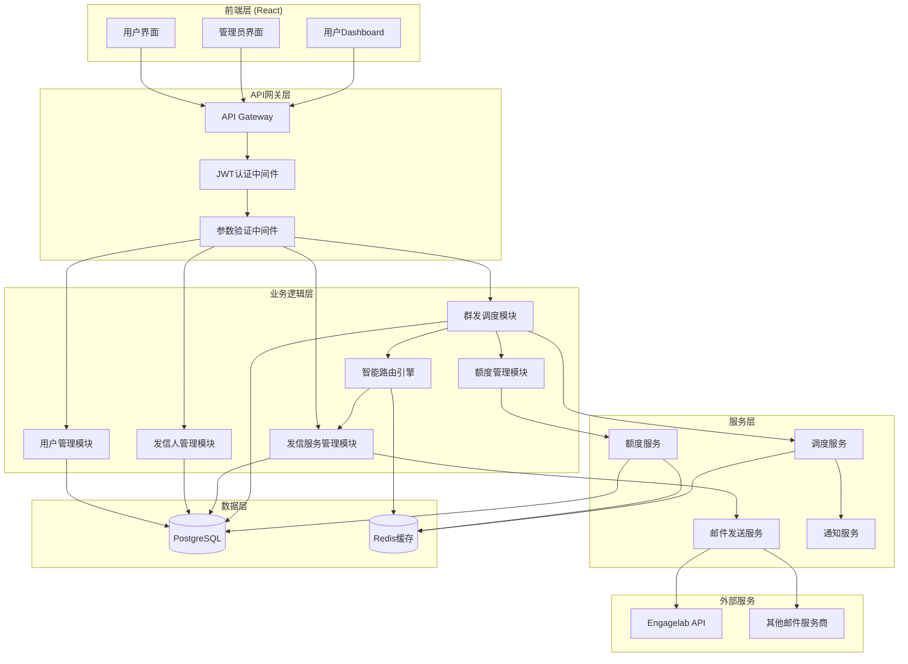
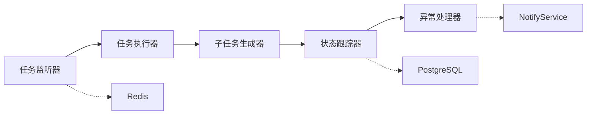
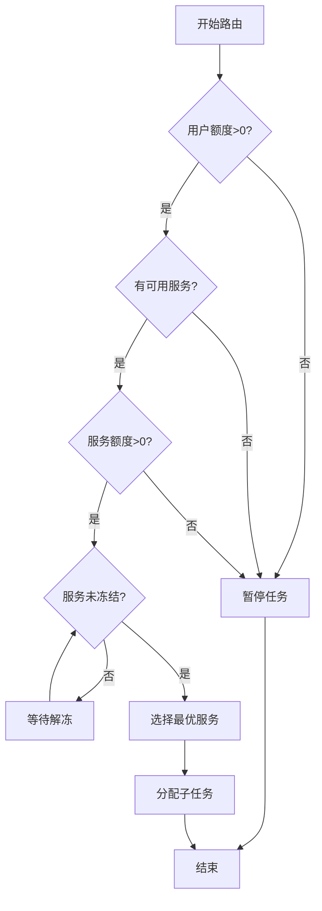
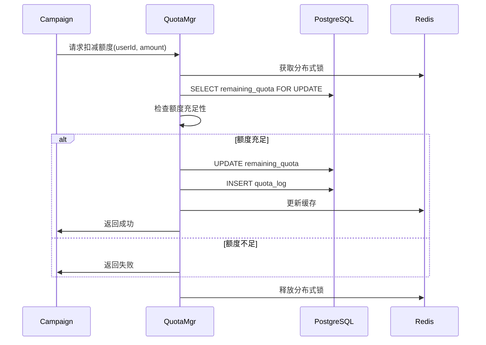
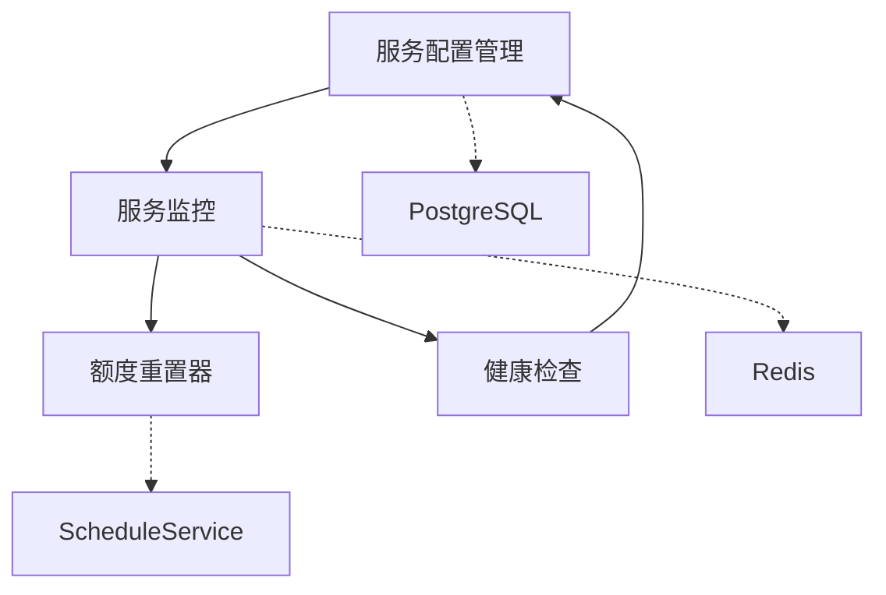
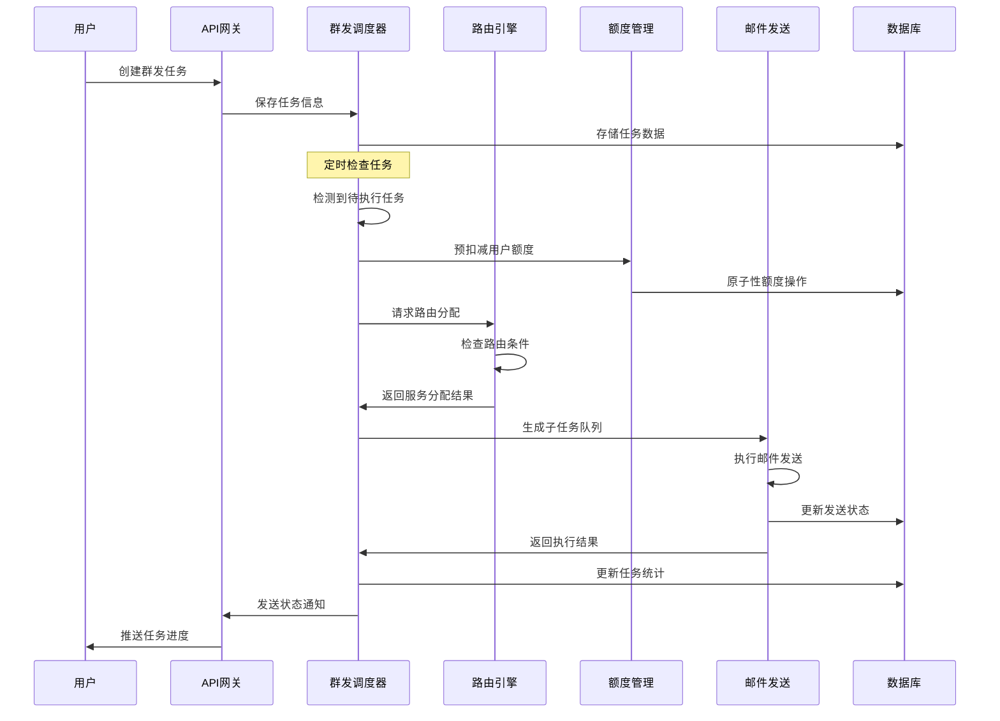
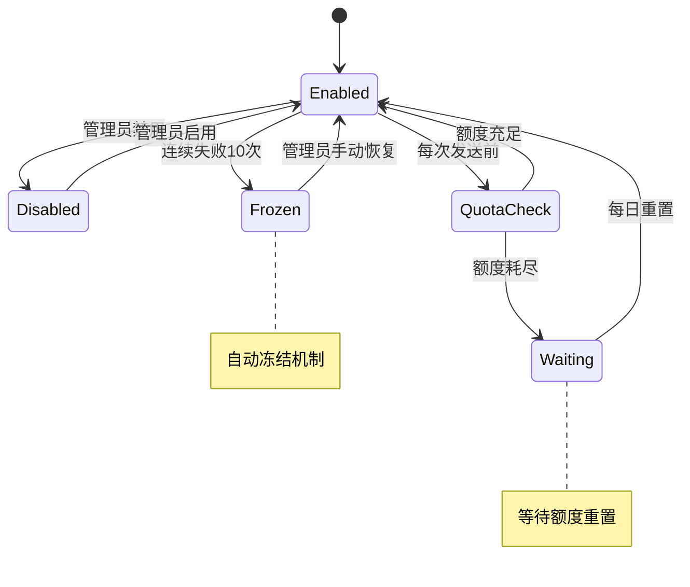

# ARCHITECTURE-002-群发调度与发信服务管理系统架构设计

## 一、架构设计概述

### 设计原则
- **单体架构优化**：保持与现有系统架构一致，避免过度设计
- **模块化设计**：功能模块清晰分离，便于维护和扩展
- **高可用性**：支持并发调度和故障恢复
- **可扩展性**：为未来业务增长预留架构空间
- **兼容性优先**：与现有UUID系统完全兼容

### 架构特点
- **技术栈统一**：Node.js + React + PostgreSQL + Redis
- **容器化部署**：Docker Compose统一环境
- **RESTful API**：标准化接口设计
- **事件驱动**：异步任务处理和状态通知

---

## 二、系统整体架构

### 2.1 系统架构图



### 2.2 分层架构说明

| 层级 | 职责 | 技术实现 |
|------|------|----------|
| **前端层** | 用户界面、交互逻辑 | React + TypeScript + Ant Design |
| **API网关层** | 路由、认证、验证 | Express.js + JWT + Joi |
| **业务逻辑层** | 核心业务逻辑处理 | Node.js + Sequelize ORM |
| **服务层** | 通用服务和工具 | Node.js + Redis + node-cron |
| **数据层** | 数据存储和缓存 | PostgreSQL + Redis |
| **外部服务** | 第三方API集成 | HTTP Client + API适配器 |

---

## 三、核心模块设计

### 3.1 群发调度模块 (CampScheduler)

#### 模块职责
- 群发任务定时监听与启动
- 子任务生成与分配
- 任务状态管理和进度跟踪
- 异常处理和恢复机制

#### 核心组件


#### 关键接口
```javascript
class CampaignScheduler {
  // 启动任务监听器（每秒轮询）
  async startTaskMonitor()
  
  // 执行单个群发任务
  async executeCampaign(campaignId)
  
  // 生成子任务
  async generateSubTasks(campaign, contacts, templates)
  
  // 更新任务状态
  async updateCampaignStatus(campaignId, status, stats)
  
  // 处理任务异常
  async handleTaskFailure(campaignId, error)
}
```

### 3.2 智能路由引擎 (RoutingEngine)

#### 模块职责
- 四重条件检查（用户额度、可用服务、服务额度、服务状态）
- 发信服务智能分配
- 负载均衡和公平调度
- 服务状态监控

#### 路由决策流程


#### 关键接口
```javascript
class RoutingEngine {
  // 路由条件检查
  async checkRoutingConditions(userId, campaignId)
  
  // 服务选择算法
  async selectOptimalService(userId, userServices)
  
  // 更新服务使用状态
  async updateServiceUsage(serviceId, operation)
  
  // 处理服务冻结
  async handleServiceFreeze(serviceId, reason)
}
```

### 3.3 额度管理模块 (QuotaMgr)

#### 模块职责
- 用户额度实时管理
- 原子性额度扣减
- 额度历史记录
- 额度不足处理

#### 额度操作流程


#### 关键接口
```javascript
class QuotaManager {
  // 原子性额度扣减
  async deductQuota(userId, amount, campaignId, reason)
  
  // 额度回退（任务取消）
  async refundQuota(userId, amount, campaignId, reason)
  
  // 管理员调整额度
  async adjustQuota(userId, amount, operatorId, reason)
  
  // 获取用户剩余额度
  async getUserQuota(userId)
}
```

### 3.4 发信服务管理模块 (EmailSvcMgr)

#### 模块职责
- 发信服务配置管理
- 服务状态监控
- 额度重置调度
- 服务健康检查

#### 服务管理架构


#### 关键接口
```javascript
class EmailServiceManager {
  // 创建发信服务
  async createEmailService(serviceData)
  
  // 更新服务状态
  async updateServiceStatus(serviceId, status, reason)
  
  // 检查服务健康状态
  async checkServiceHealth(serviceId)
  
  // 重置每日额度
  async resetDailyQuota(serviceId)
  
  // 处理服务失败
  async handleServiceFailure(serviceId, failureCount)
}
```

---

## 四、技术选型表

### 4.1 后端技术栈

| 类别 | 技术选择 | 当前版本 | 架构建议版本 | 状态 |
|------|----------|----------|-------------|------|
| **运行环境** | Node.js | >=16.0.0 | 18 LTS | ⚠️ 建议升级 |
| **Web框架** | Express.js | 4.18.2 | 4.x | ✅ 版本匹配 |
| **ORM框架** | Sequelize | 6.37.7 | 6.x | ✅ 版本匹配 |
| **数据库** | PostgreSQL | 14 | 14 | ✅ 版本匹配 |
| **缓存** | Redis | 未启用 | 7.x | ❌ 需要启用 |
| **任务调度** | node-schedule | 2.1.1 | 3.x | ⚠️ 建议升级 |
| **HTTP客户端** | axios (前端) | 1.6.0 | 1.x | ✅ 版本匹配 |
| **认证** | jsonwebtoken | 9.0.1 | 9.x | ✅ 版本匹配 |
| **验证** | joi | 17.9.2 | 17.x | ✅ 版本匹配 |
| **日志** | winston | 3.17.0 | 3.x | ✅ 版本匹配 |
| **UUID生成** | uuid | 9.0.1 | 9.x | ✅ 版本匹配 |

### 4.2 前端技术栈

| 类别 | 技术选择 | 当前版本 | 架构建议版本 | 状态 |
|------|----------|----------|-------------|------|
| **框架** | React | 18.2.0 | 18.x | ✅ 版本匹配 |
| **语言** | TypeScript | 4.9.5 | 5.x | ⚠️ 建议升级 |
| **UI组件** | Ant Design | 5.15.0 | 5.x | ✅ 版本匹配 |
| **状态管理** | Redux Toolkit | 2.2.1 | 1.x | ✅ 高版本更好 |
| **HTTP客户端** | axios | 1.6.0 | 1.x | ✅ 版本匹配 |
| **路由** | React Router | 6.21.0 | 6.x | ✅ 版本匹配 |
| **表单** | 未配置 | - | React Hook Form 7.x | ❌ 需要添加 |
| **图表** | 未配置 | - | ECharts 5.x | ❌ 需要添加 |

### 4.3 基础设施

| 类别 | 技术选择 | 当前版本 | 架构建议版本 | 状态 |
|------|----------|----------|-------------|------|
| **容器化** | Docker | 自动 | 24.x | ✅ 使用最新 |
| **编排** | Docker Compose | 3.8 | 2.x | ✅ 版本匹配 |
| **反向代理** | 未配置 | - | Nginx 1.24 | ❌ 未来可添加 |
| **监控** | Docker logs | - | Docker logs | ✅ 已使用 |

---

## 五、可复用模块清单

### 5.1 核心服务模块

#### UUID工具模块 (UUIDUtils)
```javascript
class UUIDUtils {
  // 生成标准UUID
  static generate()
  
  // 验证UUID格式
  static validate(uuid)
  
  // UUID数组处理
  static processArray(uuidArray)
}
```

#### 缓存服务模块 (CacheService)
```javascript
class CacheService {
  // 通用缓存操作
  async get(key)
  async set(key, value, ttl)
  async del(key)
  
  // 分布式锁
  async acquireLock(key, ttl)
  async releaseLock(key)
}
```

#### 通知服务模块 (NotificationService)
```javascript
class NotificationService {
  // 系统通知
  async sendSystemNotification(userId, message)
  
  // 邮件通知
  async sendEmailNotification(email, subject, content)
  
  // WebSocket实时通知
  async sendRealTimeNotification(userId, data)
}
```

### 5.2 业务组件模块

#### 任务状态组件 (TaskStatusComponent)
- 任务进度条
- 状态标签显示
- 实时状态更新

#### 额度显示组件 (QuotaDisplayComponent)
- 剩余额度显示
- 额度不足警告
- 实时额度更新

#### 服务状态组件 (ServiceStatusComponent)
- 服务可用状态
- 服务额度显示
- 冻结状态提示

### 5.3 工具类模块

#### API响应处理器 (ResponseHandler)
```javascript
class ResponseHandler {
  // 标准成功响应
  static success(data, message)
  
  // 标准错误响应
  static error(error, statusCode)
  
  // 分页响应
  static paginated(data, pagination)
}
```

#### 错误处理器 (ErrorHandler)
```javascript
class ErrorHandler {
  // 全局错误处理
  static handleGlobalError(error, req, res, next)
  
  // 数据库错误处理
  static handleDatabaseError(error)
  
  // 第三方API错误处理
  static handleExternalAPIError(error)
}
```

---

## 六、模块间接口设计

### 6.1 内部API接口规范

#### 标准HTTP响应格式
```json
{
  "success": true,
  "data": {},
  "message": "操作成功",
  "timestamp": "2025-01-27T10:00:00Z",
  "requestId": "uuid"
}
```

#### 错误响应格式
```json
{
  "success": false,
  "error": {
    "code": "QUOTA_INSUFFICIENT",
    "message": "用户额度不足",
    "details": {}
  },
  "timestamp": "2025-01-27T10:00:00Z",
  "requestId": "uuid"
}
```

### 6.2 服务间通信接口

#### 额度服务接口
```javascript
// 扣减额度
POST /internal/quota/deduct
{
  "userId": "uuid",
  "amount": 100,
  "campaignId": "uuid",
  "reason": "campaign_execution"
}

// 查询额度
GET /internal/quota/{userId}
```

#### 路由服务接口
```javascript
// 获取可用服务
GET /internal/routing/available-services/{userId}

// 分配发信服务
POST /internal/routing/assign-service
{
  "userId": "uuid",
  "campaignId": "uuid",
  "recipientCount": 100
}
```

#### 调度服务接口
```javascript
// 启动任务
POST /internal/scheduler/start-campaign
{
  "campaignId": "uuid",
  "scheduleTime": "2025-01-27T15:00:00Z"
}

// 暂停任务
POST /internal/scheduler/pause-campaign/{campaignId}
```

---

## 七、数据流架构

### 7.1 群发任务执行流程



### 7.2 服务状态管理流程



---

## 八、性能优化策略

### 8.1 缓存策略

| 数据类型 | 缓存方式 | TTL | 更新策略 |
|----------|----------|-----|----------|
| 用户额度 | Redis缓存 | 5分钟 | 写入时更新 |
| 服务状态 | Redis缓存 | 1分钟 | 状态变更时更新 |
| 发信人列表 | Redis缓存 | 10分钟 | 增删时清除 |
| 路由结果 | Redis缓存 | 30秒 | 服务状态变更时清除 |

### 8.2 数据库优化

| 优化策略 | 实施方案 | 预期效果 |
|----------|----------|----------|
| 索引优化 | 复合索引覆盖查询 | 查询性能提升50% |
| 分区表 | 按月分区历史数据 | 大表查询提升30% |
| 连接池 | 合理配置连接数 | 并发处理能力提升 |
| 读写分离 | 查询使用只读副本 | 减少主库压力 |

### 8.3 并发控制

| 场景 | 控制方式 | 实现机制 |
|------|----------|----------|
| 额度扣减 | 分布式锁 | Redis SETNX |
| 任务调度 | 队列机制 | Redis Stream |
| 服务分配 | 乐观锁 | 版本号控制 |
| 状态更新 | 原子操作 | 数据库事务 |

---

## 九、监控与告警

### 9.1 系统监控指标

| 监控类别 | 关键指标 | 告警阈值 |
|----------|----------|----------|
| **任务执行** | 任务成功率、执行延迟 | 成功率<95% |
| **服务状态** | 服务可用率、响应时间 | 可用率<99% |
| **额度管理** | 额度扣减错误率 | 错误率>1% |
| **数据库** | 连接数、查询耗时 | 耗时>500ms |
| **缓存** | 命中率、内存使用 | 命中率<90% |

### 9.2 业务监控

| 业务指标 | 监控方式 | 处理策略 |
|----------|----------|----------|
| 发送成功率 | 实时统计 | 低于阈值时告警 |
| 服务冻结频率 | 日志分析 | 频繁冻结时告警 |
| 用户额度使用 | 趋势分析 | 异常使用时告警 |
| 任务积压情况 | 队列监控 | 积压过多时扩容 |

---

## 十、部署架构

### 10.1 Docker Compose配置结构

```yaml
version: '3.8'
services:
  # 前端服务 - 修正端口映射
  frontend:
    build:
      context: ./src/frontend
      dockerfile: Dockerfile
    container_name: edm-frontend
    ports: 
      - "3001:3001"  # 修正：实际使用3001:3001
    environment:
      - PORT=3001
      - REACT_APP_API_BASE_URL=http://localhost:3000/api
      - GENERATE_SOURCEMAP=false
    volumes:
      - ./src/frontend:/app
      - /app/node_modules
    depends_on: [backend]
    restart: always
    networks:
      - edm-network

  # 后端服务 - 添加完整环境变量
  backend:
    build:
      context: ./src/backend
      dockerfile: Dockerfile
      no_cache: true
    container_name: edm-backend
    ports:
      - "3000:3000"
    environment:
      - NODE_ENV=development  # 根据实际环境调整
      - PORT=3000
      - DB_HOST=postgres
      - DB_PORT=5432
      - DB_NAME=amt_mail_system  # 已修正数据库名
      - DB_USER=postgres
      - DB_PASSWORD=postgres
      - REDIS_HOST=redis  # 需要启用Redis
      - REDIS_PORT=6379
      - JWT_SECRET=RXRmasE4X32fkDEwAbDiKzE7NyjPfWtC
      - JWT_EXPIRES_IN=24h
      # 群发调度相关配置
      - SCHEDULER_ENABLED=true
      - SCHEDULER_INTERVAL=1000  # 1秒检查间隔
      - MAX_CONCURRENT_CAMPAIGNS=5
      - EMAIL_SEND_RATE_LIMIT=100  # 每分钟发送限制
      # 第三方服务配置
      - ENGAGELAB_API_USER=api-glodamarket.fun
      - ENGAGELAB_API_KEY=63b81ba85732f89bde0ac9643d7bb868
    volumes:
      - ./src/backend:/app
      - /app/node_modules
    depends_on:
      postgres:
        condition: service_healthy
      redis:
        condition: service_healthy  # 依赖Redis
    restart: always
    networks:
      - edm-network
    command: npm run dev

  # 数据库服务 - 保持现有配置
  postgres:
    image: postgres:14
    container_name: edm-postgres
    ports:
      - "5432:5432"
    environment:
      - POSTGRES_USER=postgres
      - POSTGRES_PASSWORD=postgres
      - POSTGRES_DB=amt_mail_system  # 已修正
    volumes:
      - postgres_data:/var/lib/postgresql/data
      - ./db_init_scripts:/docker-entrypoint-initdb.d
    restart: always
    networks:
      - edm-network
    healthcheck:
      test: ["CMD-SHELL", "pg_isready -U postgres -d amt_mail_system"]
      interval: 10s
      timeout: 5s
      retries: 5

  # Redis服务 - 必须启用！
  redis:
    image: redis:7-alpine  # 升级到7.x版本
    container_name: edm-redis
    ports:
      - "6379:6379"
    volumes:
      - redis_data:/data
    restart: always
    networks:
      - edm-network
    healthcheck:
      test: ["CMD", "redis-cli", "ping"]
      interval: 10s
      timeout: 5s
      retries: 5
    command: redis-server --appendonly yes --maxmemory 256mb --maxmemory-policy allkeys-lru

  # Redis Commander - 管理界面
  redis-commander:
    image: rediscommander/redis-commander:latest
    container_name: edm-redis-commander
    ports:
      - "8082:8081"
    environment:
      - REDIS_HOSTS=local:redis:6379
    depends_on:
      - redis
    restart: unless-stopped
    networks:
      - edm-network

  # pgAdmin管理工具
  pgadmin:
    image: dpage/pgadmin4
    container_name: edm-pgadmin
    ports:
      - "5050:80"
    environment:
      - PGADMIN_DEFAULT_EMAIL=admin@example.com
      - PGADMIN_DEFAULT_PASSWORD=admin
    depends_on:
      - postgres
    restart: unless-stopped
    networks:
      - edm-network

networks:
  edm-network:
    driver: bridge

volumes:
  postgres_data:
    driver: local
  redis_data:  # 重新启用Redis数据卷
    driver: local
```

### 10.2 扩展性考虑

| 扩展维度 | 当前方案 | 未来扩展方案 |
|----------|----------|--------------|
| **计算资源** | 单机Docker | Kubernetes集群 |
| **数据存储** | 单一PostgreSQL | 读写分离+分片 |
| **缓存层** | 单一Redis | Redis集群 |
| **负载均衡** | Nginx | 云负载均衡器 |

---

## 十一、配置适配分析

### 11.1 关键配置不一致问题

#### ❌ **Redis服务未启用**
**问题**: 架构设计中依赖Redis进行缓存、分布式锁、任务队列管理，但现有docker-compose.yml中Redis被注释
**影响**: 群发调度、额度管理、路由引擎等核心功能无法工作
**解决方案**: 
- 立即启用Redis服务
- 升级到Redis 7.x版本
- 配置适当的内存限制和持久化策略

#### ⚠️ **端口映射不一致**
**问题**: 前端服务端口映射架构设计为3001:3000，实际为3001:3001
**影响**: 文档与实际不符，可能导致部署混乱
**解决方案**: 统一使用3001:3001映射

#### ⚠️ **依赖版本滞后**
**问题**: 多个关键依赖版本低于架构建议
**影响**: 功能特性、性能、安全性可能受限
**优先级排序**:
1. **高优先级**: Redis启用（阻塞性问题）
2. **中优先级**: Node.js升级到18 LTS、TypeScript升级到5.x
3. **低优先级**: node-schedule升级、添加React Hook Form和ECharts

### 11.2 现有配置资产分析

#### ✅ **已配置完善**
- PostgreSQL 14 + pgAdmin管理界面
- Express.js后端架构完整
- React + Ant Design前端基础
- JWT认证机制
- Sequelize ORM + UUID规范
- Docker Compose环境管理

#### 🔧 **需要补充配置**
```yaml
# 后端package.json需要添加
"dependencies": {
  "node-cron": "^3.0.2",        # 替换node-schedule
  "ioredis": "^5.3.2"           # Redis客户端优化
}

# 前端package.json需要添加  
"dependencies": {
  "react-hook-form": "^7.48.2", # 表单处理
  "echarts": "^5.4.3",          # 图表库
  "echarts-for-react": "^3.0.2" # React集成
}
```

### 11.3 环境变量适配

#### Redis连接配置（必须添加）
```bash
# .env添加
REDIS_HOST=redis
REDIS_PORT=6379
REDIS_PASSWORD=           # 如需密码
REDIS_DB=0
REDIS_KEY_PREFIX=edm:

# 群发调度配置
SCHEDULER_ENABLED=true
SCHEDULER_INTERVAL=1000   # 毫秒
MAX_CONCURRENT_CAMPAIGNS=5
EMAIL_SEND_RATE_LIMIT=100
```

#### 任务队列配置（新增）
```bash
# 任务队列设置
QUEUE_NAME=email_sending
QUEUE_CONCURRENCY=10
QUEUE_RETRY_ATTEMPTS=3
QUEUE_RETRY_DELAY=5000

# 服务冻结配置
SERVICE_FREEZE_THRESHOLD=10
SERVICE_FREEZE_DURATION=3600000  # 1小时
```

### 11.4 部署前置检查清单

#### 🔍 **必须验证项**
- [ ] Redis服务正常启动并可连接
- [ ] 后端应用能连接Redis（健康检查）
- [ ] 数据库迁移脚本包含新增表结构
- [ ] 环境变量完整配置
- [ ] 容器间网络连通性测试

#### 🧪 **功能测试项**
- [ ] 用户额度扣减原子性测试
- [ ] 发信服务路由选择逻辑测试
- [ ] 群发任务调度器工作状态测试
- [ ] 服务冻结和恢复机制测试
- [ ] 子任务生成和状态跟踪测试

### 11.5 风险评估与缓解

| 风险等级 | 风险项 | 影响 | 缓解措施 |
|---------|--------|------|----------|
| **高** | Redis服务缺失 | 核心功能不可用 | 立即启用Redis服务 |
| **中** | 版本兼容性问题 | 功能异常或性能下降 | 渐进式升级，充分测试 |
| **低** | 新增依赖引入 | 构建体积增加 | 按需引入，代码分割 |

---

**文档版本**: v1.0  
**创建日期**: 2025-01-27  
**负责人**: 架构设计Agent 