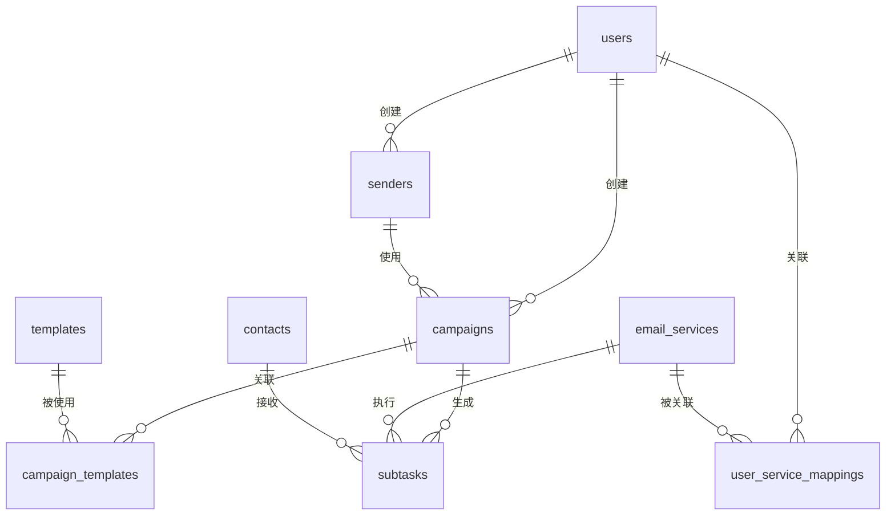

# DATABASE-002-群发调度与发信服务管理数据库设计

## 一、数据库设计概述

### 设计原则
- 保持与现有PostgreSQL数据库的兼容性
- 支持事务性要求高的核心数据操作
- 考虑高并发场景下的数据一致性
- 预留扩展字段，支持未来功能迭代

### ID类型统一规范 ⚠️
**所有ID字段统一使用UUID类型，与现有已部署系统保持一致**
- **主键ID**: `UUID` + `defaultValue: UUIDV4` (PostgreSQL UUID类型)
- **外键ID**: `UUID` 
- **严格遵循现有系统规范**，现有users、contacts、tags、templates等表已使用UUID
- 这保证与已完成UAT测试的模块完全兼容
- **PostgreSQL数组类型**：`UUID[]` 用于service_ids等数组字段

### ID字段统一汇总表
| 表名 | 主键字段 | 类型 | 外键字段 | 类型 |
|------|----------|------|----------|------|
| users | id | UUID | - | - |
| senders | id | UUID | user_id | UUID |
| email_services | id | UUID | - | - |
| user_service_mappings | id | UUID | user_id | UUID |
| subtasks | id | UUID | campaign_id, contact_id, email_service_id, template_id | UUID |
| user_quota_logs | id | UUID | user_id, campaign_id, operator_id | UUID |
| service_status_logs | id | UUID | service_id, operator_id | UUID |
| campaigns | id | UUID | user_id, sender_id | UUID |
| campaign_templates | id | UUID | campaign_id, template_id | UUID |

### 关系图概览


---

## 二、新增数据表设计

### 1. 发信人表 (senders)

| 字段名 | 类型 | 主键 | 索引 | 默认值 | 描述 |
|--------|------|------|------|--------|------|
| id | UUID | ✓ | | UUIDV4 | 发信人ID，UUID主键 |
| name | VARCHAR(100) | | ✓ | | 发信人名称，全系统唯一 |
| user_id | UUID | | ✓ | | 创建用户ID，外键关联users表 |
| created_at | TIMESTAMP | | ✓ | NOW() | 创建时间 |
| updated_at | TIMESTAMP | | | NOW() | 更新时间 |

**索引设计**:
- `UNIQUE INDEX idx_senders_name` ON (name) - 保证发信人名称全局唯一
- `INDEX idx_senders_user_id` ON (user_id) - 按用户查询优化
- `INDEX idx_senders_created_at` ON (created_at) - 时间排序优化

**约束**:
- `FOREIGN KEY (user_id) REFERENCES users(id) ON DELETE CASCADE`
- `CHECK (name IS NOT NULL AND LENGTH(name) > 0)`

---

### 2. 发信服务表 (email_services)

| 字段名 | 类型 | 主键 | 索引 | 默认值 | 描述 |
|--------|------|------|------|--------|------|
| id | UUID | ✓ | | UUIDV4 | 服务ID，UUID主键 |
| name | VARCHAR(100) | | ✓ | | 服务名称 |
| domain | VARCHAR(255) | | ✓ | | 发信域名 |
| provider | VARCHAR(50) | | | 'engagelab' | 邮局服务类型 |
| api_user | VARCHAR(255) | | | | API用户名 |
| api_key | VARCHAR(500) | | | | API密钥，加密存储 |
| daily_limit | INTEGER | | | 1000 | 每日发送额度 |
| remaining_quota | INTEGER | | | | 当日剩余额度 |
| send_interval | INTEGER | | | 60 | 发信频率（秒） |
| reset_time | TIME | | | '00:00' | 额度重置时间 |
| status | VARCHAR(20) | | ✓ | 'enabled' | 服务状态：enabled/disabled/frozen |
| failure_count | INTEGER | | | 0 | 连续失败次数 |
| last_reset_at | TIMESTAMP | | | | 上次重置时间 |
| last_sent_at | TIMESTAMP | | | | 上次发送时间 |
| created_at | TIMESTAMP | | | NOW() | 创建时间 |
| updated_at | TIMESTAMP | | | NOW() | 更新时间 |

**索引设计**:
- `UNIQUE INDEX idx_email_services_name` ON (name)
- `UNIQUE INDEX idx_email_services_domain` ON (domain)
- `INDEX idx_email_services_status` ON (status)
- `INDEX idx_email_services_reset_time` ON (reset_time)

**约束**:
- `CHECK (daily_limit > 0)`
- `CHECK (remaining_quota >= 0)`
- `CHECK (send_interval > 0)`
- `CHECK (status IN ('enabled', 'disabled', 'frozen'))`

---

### 3. 用户-发信服务关联表 (user_service_mappings)

| 字段名 | 类型 | 主键 | 索引 | 默认值 | 描述 |
|--------|------|------|------|--------|------|
| id | UUID | ✓ | | UUIDV4 | 关联ID，UUID主键 |
| user_id | UUID | | ✓ | | 用户ID，外键 |
| service_ids | UUID[] | | | | 关联的发信服务ID数组 |
| created_at | TIMESTAMP | | | NOW() | 创建时间 |
| updated_at | TIMESTAMP | | | NOW() | 更新时间 |

**索引设计**:
- `UNIQUE INDEX idx_user_service_mappings_user_id` ON (user_id) - 每个用户只能有一条记录
- `INDEX idx_user_service_mappings_service_ids` ON (service_ids) USING GIN - 数组搜索优化

**约束**:
- `FOREIGN KEY (user_id) REFERENCES users(id) ON DELETE CASCADE`
- `CHECK (array_length(service_ids, 1) > 0)` - 至少关联一个服务

---

### 4. 子任务表 (subtasks)

| 字段名 | 类型 | 主键 | 索引 | 默认值 | 描述 |
|--------|------|------|------|--------|------|
| id | UUID | ✓ | | UUIDV4 | 子任务ID，UUID主键 |
| campaign_id | UUID | | ✓ | | 群发任务ID，外键 |
| contact_id | UUID | | ✓ | | 收信人ID，外键 |
| email_service_id | UUID | | ✓ | | 发信服务ID，外键 |
| sender_address | VARCHAR(255) | | | | 发信地址（发信人@域名） |
| template_id | UUID | | ✓ | | 使用的邮件模板ID |
| email_content | TEXT | | | | 渲染后的邮件内容 |
| status | VARCHAR(20) | | ✓ | 'pending' | 子任务状态 |
| sent_at | TIMESTAMP | | ✓ | | 发送时间 |
| fail_reason | TEXT | | | | 失败原因 |
| created_at | TIMESTAMP | | | NOW() | 创建时间 |
| updated_at | TIMESTAMP | | | NOW() | 更新时间 |

**索引设计**:
- `INDEX idx_subtasks_campaign_id` ON (campaign_id)
- `INDEX idx_subtasks_status` ON (status)
- `INDEX idx_subtasks_email_service_id` ON (email_service_id)
- `INDEX idx_subtasks_sent_at` ON (sent_at)
- `COMPOSITE INDEX idx_subtasks_campaign_status` ON (campaign_id, status)

**约束**:
- `FOREIGN KEY (campaign_id) REFERENCES campaigns(id) ON DELETE CASCADE`
- `FOREIGN KEY (contact_id) REFERENCES contacts(id) ON DELETE CASCADE`
- `FOREIGN KEY (email_service_id) REFERENCES email_services(id)`
- `FOREIGN KEY (template_id) REFERENCES templates(id)`
- `CHECK (status IN ('pending', 'sending', 'sent', 'failed'))`

---

### 5. 用户额度记录表 (user_quota_logs)

| 字段名 | 类型 | 主键 | 索引 | 默认值 | 描述 |
|--------|------|------|------|--------|------|
| id | UUID | ✓ | | UUIDV4 | 记录ID，UUID主键 |
| user_id | UUID | | ✓ | | 用户ID，外键 |
| operation_type | VARCHAR(20) | | ✓ | | 操作类型：deduct/refund/adjust |
| amount | INTEGER | | | | 变更数量（正数增加，负数减少） |
| before_quota | INTEGER | | | | 操作前额度 |
| after_quota | INTEGER | | | | 操作后额度 |
| campaign_id | UUID | | ✓ | | 关联的群发任务ID（如适用） |
| reason | VARCHAR(255) | | | | 变更原因 |
| operator_id | UUID | | | | 操作人ID（管理员调整时） |
| created_at | TIMESTAMP | | ✓ | NOW() | 创建时间 |

**索引设计**:
- `INDEX idx_user_quota_logs_user_id` ON (user_id)
- `INDEX idx_user_quota_logs_operation_type` ON (operation_type)
- `INDEX idx_user_quota_logs_campaign_id` ON (campaign_id)
- `INDEX idx_user_quota_logs_created_at` ON (created_at)

**约束**:
- `FOREIGN KEY (user_id) REFERENCES users(id) ON DELETE CASCADE`
- `FOREIGN KEY (campaign_id) REFERENCES campaigns(id) ON DELETE SET NULL`
- `FOREIGN KEY (operator_id) REFERENCES users(id) ON DELETE SET NULL`
- `CHECK (operation_type IN ('deduct', 'refund', 'adjust'))`

---

### 6. 服务状态记录表 (service_status_logs)

| 字段名 | 类型 | 主键 | 索引 | 默认值 | 描述 |
|--------|------|------|------|--------|------|
| id | UUID | ✓ | | UUIDV4 | 记录ID，UUID主键 |
| service_id | UUID | | ✓ | | 发信服务ID，外键 |
| status_change | VARCHAR(50) | | ✓ | | 状态变更：enabled/disabled/frozen/quota_reset |
| before_status | VARCHAR(20) | | | | 变更前状态 |
| after_status | VARCHAR(20) | | | | 变更后状态 |
| before_quota | INTEGER | | | | 变更前额度 |
| after_quota | INTEGER | | | | 变更后额度 |
| failure_count | INTEGER | | | | 失败次数 |
| reason | VARCHAR(255) | | | | 变更原因 |
| operator_id | UUID | | | | 操作人ID（手动操作时） |
| created_at | TIMESTAMP | | ✓ | NOW() | 创建时间 |

**索引设计**:
- `INDEX idx_service_status_logs_service_id` ON (service_id)
- `INDEX idx_service_status_logs_status_change` ON (status_change)
- `INDEX idx_service_status_logs_created_at` ON (created_at)

**约束**:
- `FOREIGN KEY (service_id) REFERENCES email_services(id) ON DELETE CASCADE`
- `FOREIGN KEY (operator_id) REFERENCES users(id) ON DELETE SET NULL`

---

## 三、现有表结构调整

### 1. 用户表 (users) - 字段增加

| 新增字段名 | 类型 | 索引 | 默认值 | 描述 |
|------------|------|------|--------|------|
| role | VARCHAR(20) | ✓ | 'user' | 用户角色：admin/user |
| remaining_quota | INTEGER | | 0 | 剩余发信额度 |
| last_quota_updated | TIMESTAMP | | NOW() | 额度最后更新时间 |

**新增索引**:
- `INDEX idx_users_role` ON (role)
- `INDEX idx_users_remaining_quota` ON (remaining_quota)

**新增约束**:
- `CHECK (role IN ('admin', 'user'))`
- `CHECK (remaining_quota >= 0)`

---

### 2. 群发任务表 (campaigns) - 字段增加

| 新增字段名 | 类型 | 索引 | 默认值 | 描述 |
|------------|------|------|--------|------|
| sender_id | UUID | ✓ | | 发信人ID，外键关联senders表 |
| status | VARCHAR(20) | ✓ | 'pending' | 任务状态：pending/running/completed/paused/cancelled/failed |
| total_count | INTEGER | | 0 | 计划发送总数 |
| sent_count | INTEGER | | 0 | 已发送数量 |
| success_count | INTEGER | | 0 | 成功数量 |
| fail_count | INTEGER | | 0 | 失败数量 |
| quota_deducted | INTEGER | | 0 | 已扣减的额度 |
| started_at | TIMESTAMP | | | 开始执行时间 |
| finished_at | TIMESTAMP | | | 完成时间 |

**新增索引**:
- `INDEX idx_campaigns_sender_id` ON (sender_id)
- `INDEX idx_campaigns_status` ON (status)
- `INDEX idx_campaigns_started_at` ON (started_at)
- `COMPOSITE INDEX idx_campaigns_user_status` ON (user_id, status)

**新增约束**:
- `FOREIGN KEY (sender_id) REFERENCES senders(id)`
- `CHECK (status IN ('pending', 'running', 'completed', 'paused', 'cancelled', 'failed'))`
- `CHECK (total_count >= 0)`
- `CHECK (sent_count >= 0 AND sent_count <= total_count)`
- `CHECK (success_count >= 0 AND success_count <= sent_count)`
- `CHECK (fail_count >= 0 AND fail_count <= sent_count)`

---

### 3. 群发任务-模板关联表 (campaign_templates) - 新增

| 字段名 | 类型 | 主键 | 索引 | 默认值 | 描述 |
|--------|------|------|------|--------|------|
| id | UUID | ✓ | | UUIDV4 | 关联ID，UUID主键 |
| campaign_id | UUID | | ✓ | | 群发任务ID，外键 |
| template_id | UUID | | ✓ | | 邮件模板ID，外键 |
| created_at | TIMESTAMP | | | NOW() | 创建时间 |

**索引设计**:
- `UNIQUE INDEX idx_campaign_templates_unique` ON (campaign_id, template_id)
- `INDEX idx_campaign_templates_campaign_id` ON (campaign_id)
- `INDEX idx_campaign_templates_template_id` ON (template_id)

**约束**:
- `FOREIGN KEY (campaign_id) REFERENCES campaigns(id) ON DELETE CASCADE`
- `FOREIGN KEY (template_id) REFERENCES templates(id) ON DELETE CASCADE`

---

## 四、关键数据库函数/触发器

### 1. 额度扣减原子操作函数

```sql
CREATE OR REPLACE FUNCTION deduct_user_quota(
    p_user_id UUID,
    p_amount INTEGER,
    p_campaign_id UUID,
    p_reason VARCHAR(255)
) RETURNS BOOLEAN AS $$
DECLARE
    current_quota INTEGER;
BEGIN
    -- 使用行级锁获取当前额度
    SELECT remaining_quota INTO current_quota 
    FROM users 
    WHERE id = p_user_id 
    FOR UPDATE;
    
    -- 检查额度是否足够
    IF current_quota < p_amount THEN
        RETURN FALSE;
    END IF;
    
    -- 扣减额度
    UPDATE users 
    SET remaining_quota = remaining_quota - p_amount,
        last_quota_updated = NOW()
    WHERE id = p_user_id;
    
    -- 记录额度变更
    INSERT INTO user_quota_logs (
        user_id, operation_type, amount, before_quota, after_quota, 
        campaign_id, reason, created_at
    ) VALUES (
        p_user_id, 'deduct', -p_amount, current_quota, current_quota - p_amount,
        p_campaign_id, p_reason, NOW()
    );
    
    RETURN TRUE;
END;
$$ LANGUAGE plpgsql;
```

### 2. 发信服务额度重置触发器

```sql
CREATE OR REPLACE FUNCTION reset_service_quota()
RETURNS TRIGGER AS $$
BEGIN
    -- 记录额度重置日志
    INSERT INTO service_status_logs (
        service_id, status_change, before_quota, after_quota, 
        reason, created_at
    ) VALUES (
        NEW.id, 'quota_reset', OLD.remaining_quota, NEW.daily_limit,
        'Automatic daily reset', NOW()
    );
    
    RETURN NEW;
END;
$$ LANGUAGE plpgsql;

CREATE TRIGGER trigger_service_quota_reset
    AFTER UPDATE OF remaining_quota ON email_services
    FOR EACH ROW
    WHEN (NEW.remaining_quota = NEW.daily_limit AND OLD.remaining_quota != NEW.daily_limit)
    EXECUTE FUNCTION reset_service_quota();
```

### 3. 发信服务冻结检查函数

```sql
CREATE OR REPLACE FUNCTION check_service_freeze(p_service_id UUID)
RETURNS BOOLEAN AS $$
DECLARE
    failure_count INTEGER;
BEGIN
    SELECT failure_count INTO failure_count
    FROM email_services
    WHERE id = p_service_id;
    
    IF failure_count >= 10 THEN
        UPDATE email_services
        SET status = 'frozen'
        WHERE id = p_service_id;
        
        INSERT INTO service_status_logs (
            service_id, status_change, before_status, after_status,
            failure_count, reason, created_at
        ) VALUES (
            p_service_id, 'frozen', 'enabled', 'frozen',
            failure_count, 'Auto freeze due to 10 consecutive failures', NOW()
        );
        
        RETURN TRUE;
    END IF;
    
    RETURN FALSE;
END;
$$ LANGUAGE plpgsql;
```

---

## 五、数据迁移策略

### 1. 现有数据保留
- 保留所有现有用户、联系人、标签、邮件模板、群发任务数据
- 为现有用户设置默认角色为'user'，admin用户手动调整
- 为现有用户设置初始发信额度（由管理员后续调整）

### 2. 新表初始化
- 创建默认发信服务配置
- 为现有群发任务创建默认发信人
- 建立用户与发信服务的初始关联关系

### 3. 数据清理（如遇兼容问题）
- 根据产品经理确认，可直接清除测试数据
- 保留表结构，重新初始化数据

---

## 六、性能优化建议

### 1. 分区策略
- `subtasks`表按`created_at`时间分区（月分区）
- `user_quota_logs`表按`created_at`时间分区（月分区）
- `service_status_logs`表按`created_at`时间分区（月分区）

### 2. 缓存策略
- 用户剩余额度缓存到Redis（5分钟过期）
- 发信服务状态缓存到Redis（1分钟过期）
- 发信人列表缓存到Redis（10分钟过期）

### 3. 查询优化
- 群发任务列表查询使用复合索引
- 子任务状态统计使用物化视图
- 定期清理历史日志数据（保留6个月）

---

**文档版本**: v1.0  
**创建日期**: 2025-01-27  
**负责人**: 数据库设计Agent 