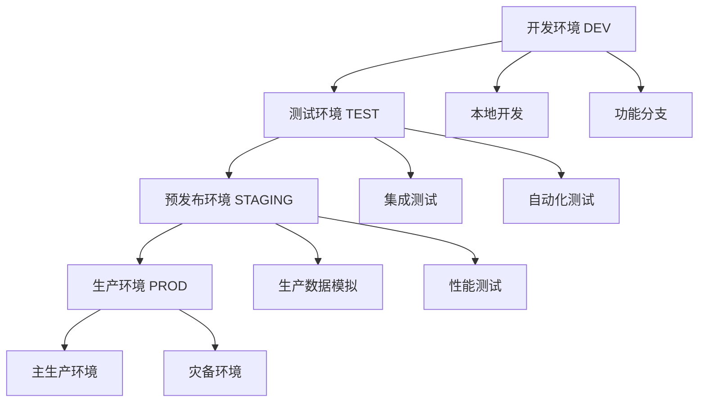
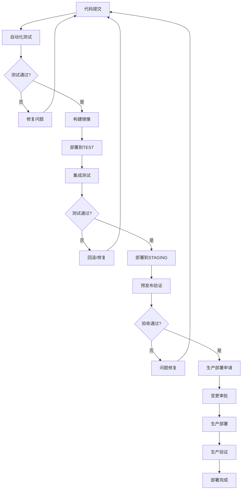
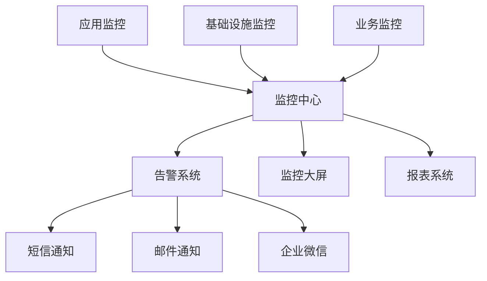

# 🚀 生产环境部署管理规范

> **版本**: v1.0  
> **制定人**: 资深项目经理 (10年经验)  
> **适用范围**: EDM邮件营销系统及类似Web应用  
> **最后更新**: 2025-06-14

---

## 📋 **目录**

1. [环境分层管理](#环境分层管理)
2. [部署流程标准](#部署流程标准)
3. [配置管理规范](#配置管理规范)
4. [发布管理流程](#发布管理流程)
5. [回滚应急预案](#回滚应急预案)
6. [监控与告警](#监控与告警)
7. [安全合规要求](#安全合规要求)
8. [团队协作规范](#团队协作规范)

---

## 🏗️ **环境分层管理**

### **环境架构**



### **环境配置标准**

| 环境 | 域名 | 服务器配置 | 数据库 | 用途 |
|------|------|------------|--------|------|
| **DEV** | localhost:3001 | 2C4G | SQLite/本地PG | 功能开发 |
| **TEST** | test.tkmail.fun | 2C4G | 独立PG实例 | 集成测试 |
| **STAGING** | staging.tkmail.fun | 4C8G | 生产数据副本 | 预发布验证 |
| **PROD** | tkmail.fun | 4C8G+ | 高可用PG集群 | 生产服务 |

### **环境隔离原则**

1. **网络隔离**: 不同环境使用独立的网络段
2. **数据隔离**: 严禁生产数据流入测试环境
3. **权限隔离**: 不同环境使用不同的访问凭证
4. **配置隔离**: 环境变量和配置文件完全分离

---

## 🔄 **部署流程标准**

### **标准部署流程**



### **部署检查清单**

#### **部署前检查 (Pre-Deployment)**
- [ ] 代码已合并到主分支
- [ ] 所有自动化测试通过
- [ ] 数据库迁移脚本已准备
- [ ] 配置文件已更新
- [ ] 依赖服务状态正常
- [ ] 备份已完成
- [ ] 回滚方案已准备

#### **部署中监控 (During Deployment)**
- [ ] 服务健康检查
- [ ] 数据库连接状态
- [ ] 关键业务功能验证
- [ ] 性能指标监控
- [ ] 错误日志监控

#### **部署后验证 (Post-Deployment)**
- [ ] 核心功能冒烟测试
- [ ] API接口响应验证
- [ ] 数据一致性检查
- [ ] 性能基准对比
- [ ] 用户访问验证

---

## ⚙️ **配置管理规范**

### **配置文件结构**

```
config/
├── environments/
│   ├── development.yml      # 开发环境配置
│   ├── test.yml            # 测试环境配置
│   ├── staging.yml         # 预发布环境配置
│   └── production.yml      # 生产环境配置
├── secrets/
│   ├── dev-secrets.yml     # 开发环境密钥
│   ├── test-secrets.yml    # 测试环境密钥
│   ├── staging-secrets.yml # 预发布环境密钥
│   └── prod-secrets.yml    # 生产环境密钥 (加密存储)
└── templates/
    ├── docker-compose.template.yml
    ├── nginx.template.conf
    └── env.template
```

### **环境变量管理**

#### **分类标准**
1. **公开配置**: 可以提交到代码仓库
2. **敏感配置**: 必须加密存储，不能明文提交
3. **环境特定**: 每个环境都不同的配置

#### **命名规范**
```bash
# 应用配置
APP_NAME=tkmail-edm
APP_VERSION=1.0.0
APP_ENV=production

# 数据库配置
DB_HOST=postgres.internal
DB_PORT=5432
DB_NAME=amt_mail_system
DB_USER=edm_user
DB_PASSWORD=${SECRET_DB_PASSWORD}  # 从密钥管理系统获取

# API配置
API_BASE_URL=https://api.tkmail.fun
API_TIMEOUT=30000
API_RATE_LIMIT=1000

# 服务配置
REDIS_HOST=redis.internal
REDIS_PORT=6379
REDIS_PASSWORD=${SECRET_REDIS_PASSWORD}

# 监控配置
LOG_LEVEL=info
METRICS_ENABLED=true
HEALTH_CHECK_INTERVAL=30
```

### **配置更新流程**

1. **配置变更申请**
   - 填写变更申请表
   - 说明变更原因和影响范围
   - 提供回滚方案

2. **配置审核**
   - 技术负责人审核
   - 安全团队审核（涉及敏感配置）
   - 运维团队审核

3. **配置部署**
   - 先在测试环境验证
   - 逐步推广到生产环境
   - 监控配置生效情况

---

## 📦 **发布管理流程**

### **版本管理策略**

#### **版本号规范**
采用语义化版本控制 (Semantic Versioning)：`MAJOR.MINOR.PATCH`

- **MAJOR**: 不兼容的API修改
- **MINOR**: 向后兼容的功能性新增
- **PATCH**: 向后兼容的问题修正

#### **分支管理策略**
```
main (生产分支)
├── develop (开发分支)
├── feature/xxx (功能分支)
├── hotfix/xxx (热修复分支)
└── release/x.x.x (发布分支)
```

### **发布类型定义**

#### **1. 常规发布 (Regular Release)**
- **频率**: 每2周一次
- **内容**: 新功能、优化改进
- **流程**: 完整的测试和审批流程
- **时间窗口**: 工作日上午10:00-12:00

#### **2. 热修复发布 (Hotfix Release)**
- **触发条件**: 生产环境严重问题
- **响应时间**: 2小时内
- **流程**: 简化流程，事后补充文档
- **审批**: 技术负责人直接审批

#### **3. 紧急发布 (Emergency Release)**
- **触发条件**: 安全漏洞、系统崩溃
- **响应时间**: 30分钟内
- **流程**: 最小化流程，优先恢复服务
- **审批**: 值班负责人直接决策

### **发布窗口管理**

#### **标准发布窗口**
- **工作日**: 10:00-12:00, 14:00-16:00
- **避免时间**: 周五下午、节假日前
- **禁止时间**: 重要业务高峰期

#### **发布冻结期**
- 重要节假日前1周
- 重大活动期间
- 系统维护期间

---

## 🔙 **回滚应急预案**

### **回滚触发条件**

1. **自动触发**
   - 健康检查失败超过阈值
   - 错误率超过5%
   - 响应时间超过基准线200%

2. **手动触发**
   - 发现严重功能问题
   - 数据一致性问题
   - 安全漏洞

### **回滚策略**

#### **1. 蓝绿部署回滚**
```bash
# 快速切换到上一版本
./scripts/rollback-blue-green.sh --version=previous
```

#### **2. 滚动回滚**
```bash
# 逐步回滚各个服务实例
./scripts/rolling-rollback.sh --service=frontend --version=1.2.3
```

#### **3. 数据库回滚**
```bash
# 数据库迁移回滚
./scripts/db-rollback.sh --migration=20250613_001
```

### **回滚验证清单**

- [ ] 服务状态恢复正常
- [ ] 核心功能验证通过
- [ ] 数据一致性检查
- [ ] 用户访问正常
- [ ] 监控指标恢复
- [ ] 日志无异常错误

---

## 📊 **监控与告警**

### **监控体系架构**



### **关键指标定义**

#### **应用层指标**
- **可用性**: 99.9%
- **响应时间**: P95 < 500ms
- **错误率**: < 0.1%
- **吞吐量**: > 1000 QPS

#### **基础设施指标**
- **CPU使用率**: < 70%
- **内存使用率**: < 80%
- **磁盘使用率**: < 85%
- **网络延迟**: < 50ms

#### **业务指标**
- **用户登录成功率**: > 99%
- **邮件发送成功率**: > 98%
- **API调用成功率**: > 99.5%

### **告警级别定义**

| 级别 | 响应时间 | 通知方式 | 处理要求 |
|------|----------|----------|----------|
| **P0-紧急** | 5分钟 | 电话+短信+微信 | 立即处理 |
| **P1-严重** | 15分钟 | 短信+微信 | 2小时内处理 |
| **P2-重要** | 30分钟 | 微信+邮件 | 24小时内处理 |
| **P3-一般** | 1小时 | 邮件 | 72小时内处理 |

---

## 🔒 **安全合规要求**

### **访问控制**

#### **权限分级**
1. **只读权限**: 查看监控、日志
2. **操作权限**: 重启服务、查看配置
3. **部署权限**: 执行部署、修改配置
4. **管理权限**: 用户管理、系统配置

#### **访问审计**
- 所有操作必须记录日志
- 敏感操作需要双人确认
- 定期审计访问权限

### **数据安全**

#### **数据分类**
- **公开数据**: 产品介绍、帮助文档
- **内部数据**: 系统配置、业务数据
- **机密数据**: 用户密码、API密钥
- **绝密数据**: 财务数据、核心算法

#### **加密要求**
- 传输加密: TLS 1.3
- 存储加密: AES-256
- 密钥管理: 专用密钥管理系统

### **合规检查清单**

- [ ] SSL证书有效期检查
- [ ] 密码策略符合要求
- [ ] 访问日志完整记录
- [ ] 数据备份加密存储
- [ ] 第三方组件安全扫描
- [ ] 代码安全审计

---

## 👥 **团队协作规范**

### **角色职责定义**

#### **项目经理 (PM)**
- 制定发布计划
- 协调各团队资源
- 风险评估和控制
- 发布决策

#### **技术负责人 (TL)**
- 技术方案审核
- 代码质量把控
- 架构决策
- 技术风险评估

#### **开发工程师 (DEV)**
- 功能开发实现
- 单元测试编写
- 代码审查参与
- 技术文档编写

#### **测试工程师 (QA)**
- 测试用例设计
- 自动化测试维护
- 质量把关
- 缺陷跟踪

#### **运维工程师 (OPS)**
- 环境维护
- 部署执行
- 监控告警
- 应急响应

### **沟通协作流程**

#### **日常沟通**
- **每日站会**: 9:30-9:45，同步进度和问题
- **周例会**: 每周一10:00，回顾和计划
- **月度总结**: 每月最后一个工作日，总结和改进

#### **发布沟通**
- **发布前会议**: 发布前1天，确认准备情况
- **发布中沟通**: 实时沟通群，及时同步状态
- **发布后总结**: 发布后1天，总结经验教训

### **文档管理规范**

#### **必备文档**
- [ ] 部署手册
- [ ] 运维手册
- [ ] 应急预案
- [ ] 架构文档
- [ ] API文档
- [ ] 变更记录

#### **文档更新要求**
- 代码变更必须同步更新文档
- 文档版本与代码版本保持一致
- 定期审查文档的准确性

---

## 📈 **持续改进机制**

### **度量指标**

#### **效率指标**
- 部署频率: 目标每周2次
- 部署成功率: 目标 > 95%
- 平均部署时间: 目标 < 30分钟
- 回滚率: 目标 < 5%

#### **质量指标**
- 生产环境故障率: 目标 < 1次/月
- 平均故障恢复时间: 目标 < 2小时
- 客户满意度: 目标 > 4.5/5
- 系统可用性: 目标 99.9%

### **改进流程**

1. **数据收集**: 自动化收集各项指标
2. **定期分析**: 每月分析趋势和问题
3. **改进计划**: 制定具体的改进措施
4. **实施跟踪**: 跟踪改进措施的效果
5. **经验总结**: 形成最佳实践文档

### **学习分享**

- **技术分享会**: 每月一次，分享新技术和经验
- **故障复盘**: 每次故障后进行深度复盘
- **最佳实践**: 总结和推广成功经验
- **外部学习**: 参加行业会议和培训

---

## 🛠️ **工具和自动化**

### **推荐工具栈**

#### **CI/CD工具**
- **Jenkins**: 持续集成和部署
- **GitLab CI**: 代码仓库集成的CI/CD
- **GitHub Actions**: 轻量级自动化

#### **监控工具**
- **Prometheus**: 指标收集
- **Grafana**: 监控大屏
- **ELK Stack**: 日志分析
- **Jaeger**: 链路追踪

#### **部署工具**
- **Docker**: 容器化
- **Kubernetes**: 容器编排
- **Ansible**: 配置管理
- **Terraform**: 基础设施即代码

### **自动化脚本**

#### **部署脚本**
```bash
#!/bin/bash
# 标准部署脚本模板
./scripts/deploy.sh --env=production --version=1.2.3 --confirm
```

#### **健康检查脚本**
```bash
#!/bin/bash
# 健康检查脚本
./scripts/health-check.sh --service=all --timeout=30
```

#### **回滚脚本**
```bash
#!/bin/bash
# 快速回滚脚本
./scripts/rollback.sh --version=previous --confirm
```

---

## 📞 **应急联系方式**

### **值班制度**

#### **7x24小时值班**
- **工作日**: 9:00-18:00 正常值班
- **非工作时间**: 轮流值班
- **节假日**: 专人值班

#### **联系方式**
```
技术负责人: 138****1234
运维负责人: 139****5678
项目经理: 137****9012
值班热线: 400-****-****
```

### **升级机制**

1. **L1支持**: 值班工程师 (响应时间: 15分钟)
2. **L2支持**: 技术专家 (响应时间: 30分钟)
3. **L3支持**: 架构师/CTO (响应时间: 1小时)

---

## 📋 **检查清单模板**

### **生产发布检查清单**

#### **发布前检查**
- [ ] 代码已通过所有测试
- [ ] 数据库迁移脚本已准备
- [ ] 配置文件已更新
- [ ] 依赖服务状态正常
- [ ] 监控告警已配置
- [ ] 回滚方案已准备
- [ ] 团队成员已通知
- [ ] 发布窗口已确认

#### **发布中检查**
- [ ] 服务停止成功
- [ ] 代码部署成功
- [ ] 数据库迁移成功
- [ ] 服务启动成功
- [ ] 健康检查通过
- [ ] 基本功能验证

#### **发布后检查**
- [ ] 核心功能冒烟测试
- [ ] 性能指标正常
- [ ] 错误日志检查
- [ ] 用户反馈收集
- [ ] 监控指标确认
- [ ] 发布记录更新

---

## 📚 **相关文档**

- [Docker部署指南](./DOCKER-DEPLOYMENT-GUIDE.md)
- [数据库管理规范](./DATABASE-MANAGEMENT.md)
- [安全配置指南](./SECURITY-CONFIGURATION.md)
- [监控配置指南](./MONITORING-SETUP.md)
- [故障处理手册](./INCIDENT-RESPONSE.md)

---

## 📝 **版本历史**

| 版本 | 日期 | 修改内容 | 修改人 |
|------|------|----------|--------|
| v1.0 | 2025-06-14 | 初始版本创建 | 项目经理 |

---

**© 2025 EDM项目团队 - 生产环境部署管理规范** 