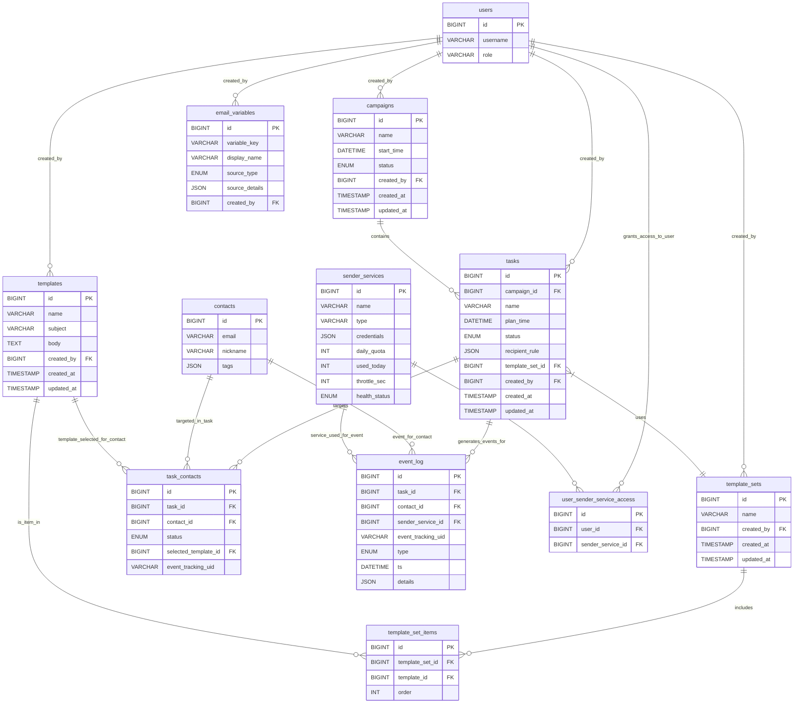

# 数据库设计：批量发信模块 (MVP 方案二 v1.0)

**核心原则：**
*   遵循 `AMT_Email_ColdSend_System_V2.md` 中的数据模型和关系摘要。
*   为用户故事和页面结构中新增的功能和字段提供支持。
*   考虑数据的完整性、查询效率和未来扩展性。

## 1. 表结构定义

### 1.1 `users` (用户表 - 假设已存在)
*   仅列出与本模块相关的关联字段。
| 字段名        | 类型          | 主键 | 索引 | 默认值 | 描述         |
|---------------|---------------|------|------|--------|--------------|
| `id`          | `BIGINT`      | PK   | 是   | AUTO_INCREMENT | 用户唯一标识 |
| `username`    | `VARCHAR(255)`|      | 是(UNIQUE) |        | 用户名       |
| `role`        | `VARCHAR(50)` |      | 是   |        | 用户角色 (e.g., 'operator', 'admin') |
| ...           | ...           | ...  | ...  | ...    | 其他用户字段 |

### 1.2 `campaigns` (任务组)
| 字段名        | 类型          | 主键 | 索引 | 默认值    | 描述             |
|---------------|---------------|------|------|-----------|------------------|
| `id`          | `BIGINT`      | PK   | 是   | AUTO_INCREMENT | 任务组唯一标识     |
| `name`        | `VARCHAR(255)`|      |      |           | Campaign 名称    |
| `start_time`  | `DATETIME`    |      | 是   |           | 计划第一次发送时间 T |
| `status`      | `ENUM('draft', 'active', 'paused', 'completed', 'cancelled')` |      | 是   | `'draft'` | Campaign 状态    |
| `created_by`  | `BIGINT`      |      | 是   |           | 创建人用户 ID (FK, references `users.id`) | 
| `created_at`  | `TIMESTAMP`   |      |      | `CURRENT_TIMESTAMP` | 创建时间         |
| `updated_at`  | `TIMESTAMP`   |      |      | `CURRENT_TIMESTAMP` ON UPDATE `CURRENT_TIMESTAMP` | 最后修改时间     |

### 1.3 `tasks` (任务)
| 字段名        | 类型          | 主键 | 索引 | 默认值    | 描述                  |
|---------------|---------------|------|------|-----------|-----------------------|
| `id`          | `BIGINT`      | PK   | 是   | AUTO_INCREMENT | 任务唯一标识            |
| `campaign_id` | `BIGINT`      |      | 是   |           | 所属 Campaign ID (FK, references `campaigns.id`) | 
| `name`        | `VARCHAR(255)`|      |      |           | Task 名称             |
| `plan_time`   | `DATETIME`    |      | 是   |           | 计划发送时间          |
| `status`      | `ENUM('draft', 'scheduled', 'sending', 'finished', 'paused', 'failed')` |      | 是   | `'draft'` | Task 状态             |
| `recipient_rule`| `JSON`        |      |      |           | 收件人规则 (US03.1)   |
| `template_set_id`| `BIGINT`     |      | 是   |           | 关联的模板组 ID (FK, references `template_sets.id`) | 
| `actual_start_time` | `DATETIME` |      |      | `NULL`    | 实际开始发送时间        |
| `actual_end_time` | `DATETIME`   |      |      | `NULL`    | 实际完成发送时间        |
| `summary_stats` | `JSON`        |      |      | `NULL`    | 统计摘要 (发送数，送达数等) |
| `created_by`  | `BIGINT`      |      | 是   |           | 创建人用户 ID (FK, references `users.id`) |
| `created_at`  | `TIMESTAMP`   |      |      | `CURRENT_TIMESTAMP` | 创建时间              |
| `updated_at`  | `TIMESTAMP`   |      |      | `CURRENT_TIMESTAMP` ON UPDATE `CURRENT_TIMESTAMP` | 最后修改时间          |

### 1.4 `templates` (邮件模板)
| 字段名        | 类型          | 主键 | 索引 | 默认值    | 描述             |
|---------------|---------------|------|------|-----------|------------------|
| `id`          | `BIGINT`      | PK   | 是   | AUTO_INCREMENT | 模板唯一标识       |
| `name`        | `VARCHAR(255)`|      | 是   |           | 模板名称         |
| `subject`     | `VARCHAR(500)`|      |      |           | 邮件标题 (P02)   |
| `body`        | `TEXT`        |      |      |           | 邮件正文 (HTML) (P02) |
| `created_by`  | `BIGINT`      |      | 是   |           | 创建人用户 ID (FK, references `users.id`) |
| `created_at`  | `TIMESTAMP`   |      |      | `CURRENT_TIMESTAMP` | 创建时间         |
| `updated_at`  | `TIMESTAMP`   |      |      | `CURRENT_TIMESTAMP` ON UPDATE `CURRENT_TIMESTAMP` | 最后修改时间     |

### 1.5 `template_sets` (模板组)
| 字段名        | 类型          | 主键 | 索引 | 默认值    | 描述             |
|---------------|---------------|------|------|-----------|------------------|
| `id`          | `BIGINT`      | PK   | 是   | AUTO_INCREMENT | 模板组唯一标识     |
| `name`        | `VARCHAR(255)`|      | 是   |           | 模板组名称       |
| `created_by`  | `BIGINT`      |      | 是   |           | 创建人用户 ID (FK, references `users.id`) |
| `created_at`  | `TIMESTAMP`   |      |      | `CURRENT_TIMESTAMP` | 创建时间         |
| `updated_at`  | `TIMESTAMP`   |      |      | `CURRENT_TIMESTAMP` ON UPDATE `CURRENT_TIMESTAMP` | 最后修改时间     |

### 1.6 `template_set_items` (模板组包含的模板)
| 字段名           | 类型     | 主键   | 索引 | 默认值 | 描述             |
|------------------|----------|--------|------|--------|------------------|
| `id`             | `BIGINT` | PK     | 是   | AUTO_INCREMENT | 关联记录唯一标识   |
| `template_set_id`| `BIGINT` |        | 是   |        | 模板组 ID (FK, references `template_sets.id`) | 
| `template_id`    | `BIGINT` |        | 是   |        | 邮件模板 ID (FK, references `templates.id`) | 
| `order`          | `INT`    |        |      | `0`    | 模板在组内的顺序（用于轮询） |
| `created_at`     | `TIMESTAMP`|        |      | `CURRENT_TIMESTAMP` | 创建时间         |
*   复合唯一索引: (`template_set_id`, `template_id`)
*   复合索引: (`template_set_id`, `order`)

### 1.7 `contacts` (联系人)
| 字段名        | 类型          | 主键 | 索引 | 默认值 | 描述          |
|---------------|---------------|------|------|--------|---------------|
| `id`          | `BIGINT`      | PK   | 是   | AUTO_INCREMENT | 联系人唯一标识   |
| `email`       | `VARCHAR(255)`|      | 是(UNIQUE) |        | 邮箱地址      |
| `nickname`    | `VARCHAR(255)`|      |      | `NULL` | 昵称          |
| `tags`        | `JSON`        |      |      | `NULL` | 用户标签列表 (例如 `["tagA", "tagB"]` ) |
| `created_at`  | `TIMESTAMP`   |      |      | `CURRENT_TIMESTAMP` | 创建时间      |
| `updated_at`  | `TIMESTAMP`   |      |      | `CURRENT_TIMESTAMP` ON UPDATE `CURRENT_TIMESTAMP` | 最后修改时间  |

### 1.8 `sender_services` (发件服务)
| 字段名        | 类型          | 主键 | 索引 | 默认值    | 描述                   |
|---------------|---------------|------|------|-----------|------------------------|
| `id`          | `BIGINT`      | PK   | 是   | AUTO_INCREMENT | 服务唯一标识             |
| `name`        | `VARCHAR(255)`|      |      |           | 服务名称               |
| `type`        | `VARCHAR(50)` |      |      | `'jiguang'`| 服务类型 (如 'jiguang', 'smtp') |
| `credentials` | `JSON`        |      |      |           | 服务凭证 (加密存储, e.g., API Key, Secret) |
| `daily_quota` | `INT`         |      |      | `0`       | 每日发送额度           |
| `used_today`  | `INT`         |      |      | `0`       | 当日已用额度 (需每日重置) |
| `throttle_sec`| `INT`         |      |      | `1`       | 每封邮件发送间隔秒数（系统侧主动限流） |
| `health_status`| `ENUM('active', 'frozen')` |      | 是   | `'active'`| 健康状态               |
| `last_error_at`| `DATETIME`   |      |      | `NULL`    | 最后一次错误时间         |
| `consecutive_errors`| `INT`    |      |      | `0`       | 连续错误次数           |
| `created_at`  | `TIMESTAMP`   |      |      | `CURRENT_TIMESTAMP` | 创建时间               |
| `updated_at`  | `TIMESTAMP`   |      |      | `CURRENT_TIMESTAMP` ON UPDATE `CURRENT_TIMESTAMP` | 最后修改时间           |

### 1.9 `task_contacts` (任务与联系人的发送清单)
| 字段名        | 类型          | 主键 | 索引 | 默认值 | 描述                      |
|---------------|---------------|------|------|--------|---------------------------|
| `id`          | `BIGINT`      | PK   | 是   | AUTO_INCREMENT | 记录唯一标识                |
| `task_id`     | `BIGINT`      |      | 是   |        | 任务 ID (FK, references `tasks.id`) | 
| `contact_id`  | `BIGINT`      |      | 是   |        | 联系人 ID (FK, references `contacts.id`) | 
| `status`      | `ENUM('pending', 'sent', 'failed_to_send', 'delivered', 'bounced', 'opened', 'clicked', 'unsubscribed')` |      | 是   | `'pending'` | 该联系人在该任务中的最终状态 (聚合 event_log) |
| `selected_template_id` | `BIGINT` |      | 是   | `NULL` | 为此联系人选择的模板 ID (FK, references `templates.id`) | 
| `scheduled_send_at` | `DATETIME`|      |      | `NULL` | 计划对此联系人的发送时间（可用于更细粒度控制） |
| `sent_at`     | `DATETIME`    |      |      | `NULL` | 实际发送时间（API调用时刻） |
| `error_message`| `TEXT`       |      |      | `NULL` | 发送失败时的错误信息        |
| `event_tracking_uid` | `VARCHAR(255)` |    | 是(UNIQUE) | `NULL` | 用于追踪像素和点击链接的唯一ID |
*   复合唯一索引: (`task_id`, `contact_id`)

### 1.10 `event_log` (事件日志)
| 字段名        | 类型          | 主键 | 索引 | 默认值 | 描述                      |
|---------------|---------------|------|------|--------|---------------------------|
| `id`          | `BIGINT`      | PK   | 是   | AUTO_INCREMENT | 事件唯一标识                |
| `task_id`     | `BIGINT`      |      | 是   |        | 任务 ID (FK, references `tasks.id`) | 
| `contact_id`  | `BIGINT`      |      | 是   |        | 联系人 ID (FK, references `contacts.id`) | 
| `sender_service_id` | `BIGINT`|      | 是   | `NULL` | 使用的发件服务 ID (FK, references `sender_services.id`) | 
| `event_tracking_uid`| `VARCHAR(255)`|    | 是   | `NULL` | 关联的追踪ID (来自 `task_contacts.event_tracking_uid`) |
| `type`        | `ENUM('send_api_try', 'send_api_success', 'send_api_fail', 'delivered', 'open', 'click', 'reply', 'unsubscribe', 'bounce')` |      | 是   |        | 事件类型                  |
| `ts`          | `DATETIME`    |      | 是   | `CURRENT_TIMESTAMP` | 事件发生时间戳            |
| `details`     | `JSON`        |      |      | `NULL` | 事件详情 (如 bounce原因, 点击的URL, user_agent等) |

### 1.11 `email_variables` (邮件模板变量定义)
| 字段名          | 类型          | 主键 | 索引 | 默认值 | 描述                      |
|-----------------|---------------|------|------|--------|---------------------------|
| `id`            | `BIGINT`      | PK   | 是   | AUTO_INCREMENT | 变量唯一标识                |
| `variable_key`  | `VARCHAR(100)`|      | 是(UNIQUE) |        | 变量键名 (e.g., `contact.nickname`) |
| `display_name`  | `VARCHAR(255)`|      |      |        | 显示名称 (用于UI选择)     |
| `source_type`   | `ENUM('CONTACT_FIELD', 'CONTACT_TAG', 'SYSTEM')` |      |      |        | 变量来源类型              |
| `source_details`| `JSON`        |      |      | `NULL` | 来源配置 (e.g., `{"field": "nickname"}`) |
| `description`   | `TEXT`        |      |      | `NULL` | 变量描述                  |
| `created_by`    | `BIGINT`      |      | 是   |        | 创建人用户 ID (FK, references `users.id`) |
| `created_at`    | `TIMESTAMP`   |      |      | `CURRENT_TIMESTAMP` | 创建时间                  |
| `updated_at`    | `TIMESTAMP`   |      |      | `CURRENT_TIMESTAMP` ON UPDATE `CURRENT_TIMESTAMP` | 最后修改时间              |

### 1.12 `user_sender_service_access` (用户与发件服务关联)
| 字段名            | 类型     | 主键   | 索引 | 默认值 | 描述             |
|-------------------|----------|--------|------|--------|------------------|
| `id`              | `BIGINT` | PK     | 是   | AUTO_INCREMENT | 关联记录唯一标识   |
| `user_id`         | `BIGINT` |        | 是   |        | 用户 ID (FK, references `users.id`) | 
| `sender_service_id`| `BIGINT`|        | 是   |        | 发件服务 ID (FK, references `sender_services.id`) | 
| `created_at`      | `TIMESTAMP`|        |      | `CURRENT_TIMESTAMP` | 分配时间         |
*   复合唯一索引: (`user_id`, `sender_service_id`)

## 2. 表之间关系图 (ERD - Mermaid 语法)

---
文档版本: v1.0
最后更新: {{CURRENT_DATE}} 