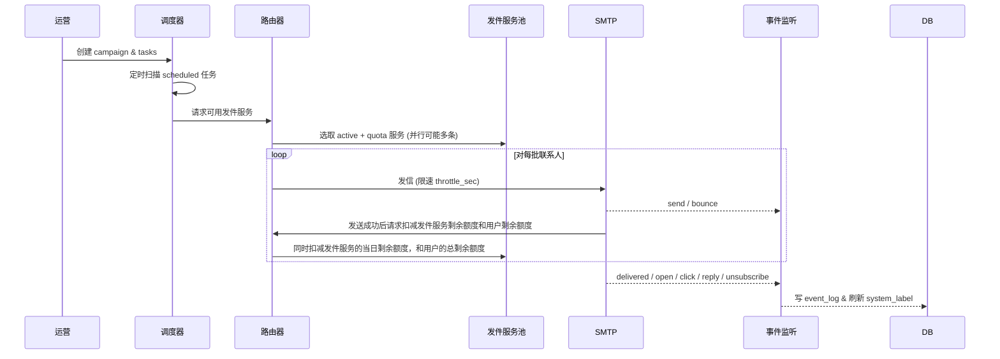

# A.MT 邮件冷发系统 V2 需求文档

## 1️⃣ 术语与范围  
| 术语 | 含义 |
|------|------|
| **任务组 (campaign)** | 一轮多阶段 EDM 计划。运营人员手动创建 1–N 个任务，并指定各自的发送时间。 |
| **任务 (task)** | 单次批量发送动作，包含「收件人集合」+「模板组」+「发件服务」。 |
| **模板组 (template_set)** | 同一任务下的多封邮件模板，投递时 **均匀随机** 挑选。 |
| **联系人 (contact)** | 收件人对象，字段仅关注 `email / nickname / tag`。 |
| **发件服务 (sender_service)** | 可用的 SMTP 通道，带每日额度与节流参数。 |
| **系统标签 (system_label)** | 由事件实时生成：`opened_in_campaign` / `unopened_in_campaign` / `clicked_in_campaign` / `replied_in_campaign` / `unreplied_in_campaign`。 |

---

## 2️⃣ 数据模型（核心字段）

### 2.1 任务组 `campaign`
| 字段 | 类型 | 说明 |
|------|------|------|
| id | bigint | PK |
| name | string | 计划名称 |
| start_time | datetime | 第一次发送时间 T |
| interval_days | int | 固定间隔 Δd |
| status | enum | draft / active / paused / completed |
| created_by | user_id | 创建人 |

### 2.2 任务 `task`
| 字段 | 说明 |
|------|------|
| id (PK)，campaign_id (FK) |
| name，plan_time (T + n·Δd) |
| template_set_id |
| recipient_rule (JSON) → 支持包含/剔除系统标签 |
| status → draft / scheduled / sending / finished / paused / failed |

### 2.3 模板组 `template_set`
| 字段 | 说明 |
|------|------|
| id (PK)，task_id (FK) |
| templates (array<template_id>) |

### 2.4 联系人 `contact`
| email (PK) | nickname | tag (string) |

### 2.5 发件服务 `sender_service`
| 字段 | 说明 |
|------|------|
| id (PK) | smtp_host / port / user |
| daily_quota | used_today | throttle_sec |
| health_status → active / frozen |

### 2.6 事件 `event_log`
| contact_id | task_id | type(send / delivered / open / click / reply / unsubscribe / bounce) | ts |

---

## 3️⃣ 关系摘要  
```
campaign 1─N task
task 1─1 template_set
task M─N contact  (经关联表 task_contact)
sender_service 1─N send_record
contact 1─N event_log
```

---

## 4️⃣ 业务流程



---

## 5️⃣ 状态机

### 任务组 `campaign`
`draft → active → completed / paused / cancelled`

### 任务 `task`
`draft → scheduled → sending → finished`  
  ↘ `paused`   ↘ `failed`

### 发件服务 `sender_service`
`active ↔ frozen`（10 min 内连续 3 次失败自动冻结；人工解冻）

---

## 6️⃣ 发件路由算法（伪代码）

```python
def pick_services(recipients):
    svc_list = [s for s in services
                if s.health == 'active' and s.used_today < s.daily_quota]
    # 按剩余额度降序
    svc_list.sort(key=lambda s: s.daily_quota - s.used_today, reverse=True)
    return svc_list            # 允许并行拆分
```

* 同一任务可拆分到多个服务并行；每个服务内部遵守 `throttle_sec` 令牌桶限速。  
* 无可用服务 → 任务 `paused` 并告警。

---

## 7️⃣ 失败与重试

| 场景 | 处理 |
|------|------|
| 单封发送失败 | 记录失败名单，不自动重试 |
| 发件服务 10 min 内失败 ≥ 3 | `frozen` + 提示冻结原因 |
| 任务调度时无可用服务 | 任务置 `paused`，等待人工恢复 |

---

## 8️⃣ 角色与权限

| 角色 | 权限 |
|------|------|
| **超级管理员** | 管理发件服务、用户及手动解冻 |
| **运营用户** | 创建/编辑任务组与任务、查看统计、导出失败名单 |

---

## 9️⃣ 监控指标

| 维度 | 指标 | 告警阈值 |
|------|------|----------|
| 发件服务 | Bounce rate | > 10 % |
| 任务 | Open rate | < 5 % 连续 3 次 |
| 服务 | 连续失败次数 | 3 次 / 10 min |

---

## 1️⃣0️⃣ 非功能 & 合规

1. **速率管控**：双限流（每日额度 + `throttle_sec`）。  
2. **日志审计**：所有修改写 `audit_log`。  
3. **数据安全**：SMTP 凭据加密；支持导出失败名单。  
4. **合规**：所有模板必须带 `unsubscribe` 链接；事件可提供 GDPR 删除接口。

---
