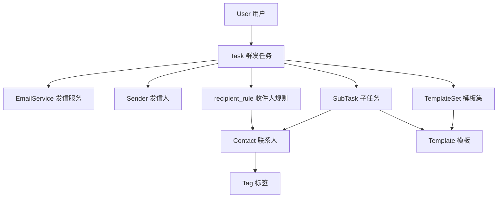

# 📊 EDM系统实体模型总结文档

## 🎯 业务实体架构概览

### 📌 实体分类

#### 🏢 核心业务实体
- **Campaign**: 营销活动系列（V2.0暂不实现）
- **Task**: 独立群发任务（V2.0核心）
- **SubTask**: 单个邮件发送子任务（V2.0新增）
- **Contact**: 联系人管理
- **Tag**: 标签分类系统

#### 📧 邮件相关实体
- **Template**: 邮件模板
- **TemplateSet**: 模板集合
- **TemplateSetItem**: 模板集关联项
- **EmailService**: 发信服务（V2.0统一）
- **Sender**: 发信人管理

#### 👥 用户与权限实体
- **User**: 用户账户
- **UserQuotaLog**: 用户额度日志
- **UserServiceMapping**: 用户服务关联

#### 📊 监控与日志实体
- **EventLog**: 系统事件日志
- **ServiceStatusLog**: 服务状态日志
- **ContactTag**: 联系人标签关联

---

## 📋 详细实体定义

### 🎯 Campaign（营销活动）
```javascript
// 业务定义：营销活动的系列管理，包含多个相关任务
// V2.0状态：暂不实现，focus在独立任务
{
  id: UUID,
  name: String,           // 活动名称
  description: String,    // 活动描述  
  status: ENUM,          // 活动状态
  user_id: UUID,         // 创建者
  start_date: Date,      // 开始日期
  end_date: Date         // 结束日期
}
```

**业务用途**: 
- 多任务的统一管理
- 营销活动的整体策划
- 跨任务的统计分析

**V2.0策略**: 暂不实现，专注独立任务功能

---

### ⚡ Task（群发任务）- V2.0核心
```javascript
// 业务定义：独立的邮件群发任务，不依赖Campaign
{
  id: UUID,
  name: String,                 // 任务名称
  description: String,          // 任务描述
  schedule_time: Date,          // 调度时间（重命名自plan_time）
  status: ENUM,                 // 任务状态：draft/scheduled/sending/paused/completed/failed/cancelled
  recipient_rule: JSONB,        // 收件人规则
  sender_id: UUID,              // 发信人ID（V2.0新增）
  email_service_id: UUID,       // 发信服务ID（V2.0新增）
  template_set_id: UUID,        // 模板集ID
  created_by: UUID,             // 创建者（重命名自user_id）
  summary_stats: JSONB,         // 统计信息
  actual_start_time: Date,      // 实际开始时间
  actual_finish_time: Date,     // 实际结束时间
  error_message: String         // 错误信息
}
```

**业务用途**:
- V2.0的核心功能：独立群发任务
- 支持定时和立即发送
- 灵活的收件人规则（specific/tag_based/all_contacts）
- 完整的状态跟踪和统计

**V2.0重要变化**:
- ❌ 移除了`campaign_id`强制依赖
- ✅ 新增`sender_id`和`email_service_id`
- ✅ `plan_time` → `schedule_time`  
- ✅ `user_id` → `created_by`
- ✅ 支持独立的任务创建和管理

---

### 🔄 SubTask（邮件发送子任务）- V2.0新增
```javascript
// 业务定义：单个邮件发送的最小单元，替代TaskContact
{
  id: UUID,
  task_id: UUID,                // 所属任务ID
  contact_id: UUID,             // 联系人ID
  sender_email: String,         // 发信人邮箱（sender@domain）
  recipient_email: String,      // 收件人邮箱
  template_id: UUID,            // 使用的模板ID
  rendered_subject: String,     // 渲染后的主题
  rendered_body: Text,          // 渲染后的内容
  status: ENUM,                 // 发送状态：pending/sent/delivered/bounced/opened/clicked/failed
  sent_at: Date,                // 发送时间
  delivered_at: Date,           // 投递时间
  opened_at: Date,              // 打开时间
  clicked_at: Date,             // 点击时间
  error_message: Text,          // 错误信息
  tracking_id: UUID,            // 跟踪ID
  email_service_response: JSONB, // 发信服务响应
  retry_count: Integer,         // 重试次数
  next_retry_at: Date           // 下次重试时间
}
```

**业务用途**:
- 单个邮件的精确跟踪
- 支持重试机制
- 详细的状态转换管理
- 邮件跟踪和统计的基础

**替代关系**: 
- ❌ 替代了混乱的`TaskContact`模型
- ✅ 更清晰的业务语义
- ✅ 完整的邮件生命周期管理

---

### 👤 Contact（联系人）
```javascript
// 业务定义：邮件营销的目标联系人
{
  id: UUID,
  name: String,            // 姓名
  email: String,           // 邮箱（唯一）
  tags: String[],          // 标签数组
  custom_fields: JSONB,    // 自定义字段
  is_subscribed: Boolean,  // 订阅状态
  created_by: UUID,        // 创建者
  unsubscribed_at: Date,   // 退订时间
  bounce_count: Integer,   // 退信次数
  last_opened_at: Date,    // 最后打开时间
  last_clicked_at: Date    // 最后点击时间
}
```

**业务用途**:
- 邮件发送的目标管理
- 标签化分类
- 订阅状态管理
- 发送效果跟踪

---

### 🏷️ Tag（标签）
```javascript
// 业务定义：联系人分类标签系统
{
  id: UUID,
  name: String,        // 标签名称（唯一）
  description: String, // 标签描述
  color: String,       // 显示颜色
  created_by: UUID,    // 创建者
  usage_count: Integer // 使用次数
}
```

**业务用途**:
- 联系人分类管理
- 任务的收件人规则筛选
- 灵活的分组策略

---

### 📧 Template（邮件模板）
```javascript
// 业务定义：邮件内容模板
{
  id: UUID,
  name: String,         // 模板名称
  type: ENUM,          // 模板类型：email/sms
  subject: String,      // 邮件主题
  body: Text,          // 邮件内容
  variables: String[], // 支持的变量
  category: String,    // 模板分类
  created_by: UUID,    // 创建者
  is_active: Boolean   // 激活状态
}
```

**业务用途**:
- 邮件内容的标准化管理
- 支持变量替换
- 模板复用和版本管理

---

### 📦 TemplateSet（模板集）
```javascript
// 业务定义：模板的集合管理
{
  id: UUID,
  name: String,        // 模板集名称
  description: String, // 描述
  user_id: UUID,       // 所有者
  is_default: Boolean  // 是否默认
}
```

**关联实体**: `TemplateSetItem`
**业务用途**:
- 多模板的组合使用
- 任务级别的模板批量管理

---

### 🚀 EmailService（发信服务）- V2.0统一
```javascript
// 业务定义：第三方邮件发送服务配置
{
  id: UUID,
  name: String,               // 服务名称
  provider: String,           // 服务商：engagelab等
  api_key: String,           // API密钥
  api_secret: String,        // API秘钥
  domain: String,            // 发信域名
  daily_quota: Integer,      // 日发送限额
  used_quota: Integer,       // 已使用额度
  sending_rate: Integer,     // 发送速率/秒
  is_enabled: Boolean,       // 启用状态
  is_frozen: Boolean,        // 冻结状态
  consecutive_failures: Integer, // 连续失败次数
  last_reset_at: Date,       // 上次额度重置时间
  last_sent_at: Date         // 上次发送时间
}
```

**业务用途**:
- 第三方发信服务管理
- 额度和速率控制
- 服务健康状态监控
- 多服务负载均衡

**V2.0重要性**: 替代了混乱的`MailService`，成为统一的发信服务实体

---

### 👨‍💼 Sender（发信人）
```javascript
// 业务定义：邮件发送的身份管理
{
  id: UUID,
  name: String,        // 发信人姓名
  email: String,       // 发信人邮箱前缀
  user_id: UUID,       // 所属用户
  is_verified: Boolean, // 验证状态
  is_default: Boolean  // 是否默认
}
```

**业务用途**:
- 发信身份管理
- 与EmailService结合形成完整发信邮箱
- 多身份切换支持

---

### 👥 User（用户）
```javascript
// 业务定义：系统用户账户
{
  id: UUID,
  username: String,        // 用户名（唯一）
  email: String,           // 邮箱（唯一）
  password_hash: String,   // 密码哈希
  role: ENUM,             // 角色：admin/user
  remaining_quota: Integer, // 剩余发送额度（V2.0新增）
  last_login_at: Date,    // 最后登录时间
  is_active: Boolean      // 激活状态
}
```

**V2.0重要变化**: 
- ✅ 新增`remaining_quota`字段支持额度管理

---

### 📊 UserQuotaLog（用户额度日志）- V2.0新增
```javascript
// 业务定义：用户额度变更记录
{
  id: UUID,
  user_id: UUID,           // 用户ID
  operation_type: ENUM,    // 操作类型：allocate/consume/refund
  amount: Integer,         // 变更数量
  before_quota: Integer,   // 变更前额度
  after_quota: Integer,    // 变更后额度
  description: String,     // 操作描述
  operated_by: UUID,       // 操作者
  created_at: Date         // 操作时间
}
```

**业务用途**:
- 额度变更的完整审计
- 额度消费追踪
- 管理员额度分配记录

---

## 🔗 实体关联关系图

### 核心业务流程关联
```
User (用户)
  ├── remaining_quota (额度)
  ├── UserQuotaLog (额度日志) 
  ├── Contact (联系人)
  ├── Sender (发信人)
  ├── Template/TemplateSet (模板)
  └── Task (群发任务)
        ├── EmailService (发信服务)
        ├── Sender (发信人) 
        ├── TemplateSet (模板集)
        ├── recipient_rule → Contact (收件人规则)
        └── SubTask[] (子任务)
              ├── Contact (联系人)
              ├── Template (模板)
              └── 邮件状态跟踪
```

### V2.0独立任务核心关联


### 额度管理关联
```
User.remaining_quota ←→ UserQuotaLog
     ↓
Task.recipient_rule → Contact数量验证
     ↓  
SubTask创建数量 = Contact数量
     ↓
额度消费记录 → UserQuotaLog
```

---

## ⚠️ 重要架构决策

### ✅ V2.0正确实体使用
- **Task**: 独立群发任务，无Campaign依赖
- **SubTask**: 单邮件追踪，替代TaskContact
- **EmailService**: 统一发信服务，替代MailService
- **User.remaining_quota**: 内置额度管理

### ❌ 已清理的冗余实体
- ~~MailService~~ → 使用EmailService
- ~~UserMailServicePermission~~ → 使用UserServiceMapping
- ~~TaskContact~~ → 使用SubTask

### 🔑 关键约束规范
1. **ID类型统一**: 所有实体主键使用UUID
2. **外键关联**: 严格使用UUID类型外键  
3. **命名规范**: 采用snake_case字段命名
4. **时间戳**: 统一使用`created_at`/`updated_at`
5. **软删除**: 使用状态字段而非物理删除

---

## 🚨 开发注意事项

### 必须遵守的规范
1. **UUID规范**: 所有ID字段必须使用UUID类型
2. **外键约束**: 数据库层面强制外键关联
3. **状态管理**: 使用ENUM严格控制状态转换
4. **索引设计**: 主要查询字段添加索引
5. **数据验证**: Model层和API层双重验证

### 禁止的操作
- ❌ 使用SERIAL/INTEGER作为主键
- ❌ 混用不同ID类型进行关联
- ❌ 绕过状态转换规则直接更新
- ❌ 在API中暴露敏感字段（password_hash, api_key等）
- ❌ 不经过Service层直接操作Model

---

*📝 文档维护者: 项目控制中心*  
*📅 最后更新: V2.0架构重构后*  
*🎯 适用版本: V2.0及以上* 